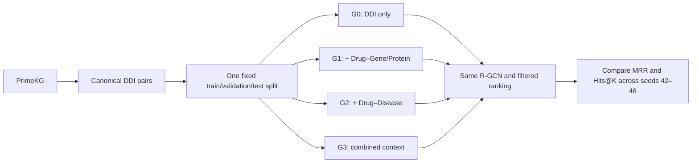
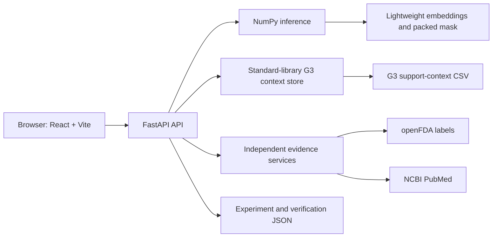

# CHEERS: PrimeKG Graph Composition + R-GCN for Drug--Drug Link Prediction

> **Research use only.** CHEERS is an academic graduation-project
> prototype, not a clinical decision-support system. Its predictions are
> unobserved links under the PrimeKG `drug_drug` target relation. Model
> scores are ranking values---not probabilities, calibrated confidence,
> clinical risk, interaction severity, or evidence that a drug pair is
> safe or dangerous.

**Repository:** `CHEERS-PrimeKG-RGCN-DDI-Prediction`\
**Web application:** CHEERS DDI Explorer\
**Final research title:** *Effect of Biomedical Knowledge Graph
Composition on R-GCN-Based Drug--Drug Interaction Prediction*\
**Team:** Team CHEERS\
**Institution:** Pusan National University\
**Project type:** Computer Science graduation project

## Table of contents

-   [Project overview](#project-overview)
-   [Scientific scope](#scientific-scope)
-   [Project evolution](#project-evolution)
-   [Final research design](#final-research-design)
-   [PrimeKG and DDI
    canonicalization](#primekg-and-ddi-canonicalization)
-   [Fixed DDI split and leakage
    safeguards](#fixed-ddi-split-and-leakage-safeguards)
-   [Graph variants](#graph-variants)
-   [Global relation mapping](#global-relation-mapping)
-   [Nodes and processed model data](#nodes-and-processed-model-data)
-   [Model architecture](#model-architecture)
-   [Negative sampling](#negative-sampling)
-   [Training and model selection](#training-and-model-selection)
-   [Filtered ranking evaluation](#filtered-ranking-evaluation)
-   [Multi-seed results](#multi-seed-results)
-   [Complementary five-seed
    classification](#complementary-five-seed-classification)
-   [Relation-level ablation study](#relation-level-ablation-study)
-   [DDI-edge cold-start evaluation](#ddi-edge-cold-start-evaluation)
-   [Interpretation of graph
    composition](#interpretation-of-graph-composition)
-   [Final model verification](#final-model-verification)
-   [Lightweight NumPy runtime](#lightweight-numpy-runtime)
-   [G3 graph-context runtime](#g3-graph-context-runtime)
-   [Independent FDA and PubMed
    evidence](#independent-fda-and-pubmed-evidence)
-   [Web application](#web-application)
-   [API reference](#api-reference)
-   [Local Windows setup](#local-windows-setup)
-   [University training environment](#university-training-environment)
-   [Original notebook pipeline](#original-notebook-pipeline)
-   [Repository structure](#repository-structure)
-   [Reproducibility levels](#reproducibility-levels)
-   [Artifacts and audit trail](#artifacts-and-audit-trail)
-   [What should be committed](#what-should-be-committed)
-   [Limitations](#limitations)
-   [Future work](#future-work)
-   [Safety and responsible use](#safety-and-responsible-use)
-   [Acknowledgment](#acknowledgment)

## Project overview

CHEERS studies the question:

> **How does biomedical knowledge graph composition affect R-GCN
> drug--drug link prediction?**

The final controlled experiment compares four PrimeKG graph variants
while holding the DDI split, R-GCN architecture, decoder, training
procedure, and evaluation protocol fixed. The graph variants range from
DDI-only topology to a heterogeneous graph combining Drug--Drug,
Drug--Gene/Protein, and Drug--Disease relationships.

The repository also contains a lightweight local demonstration
application. The application serves the independently verified final
G3/seed-44 export with NumPy, so a local user does not need the
university GPU environment, PyTorch, or PyTorch Geometric.

Three scopes must be distinguished:

  --------------------------------------------------------------------------
  Scope                   Purpose                 Status in this repository
  ----------------------- ----------------------- --------------------------
  Final graduation        Controlled G0--G3 R-GCN Results, selected
  experiment              graph-composition       checkpoint, selected G3
                          comparison              graph artifacts,
                                                  summaries, and original
                                                  inference code are
                                                  included; full
                                                  preprocessing/retraining
                                                  workspace is not

  Earlier project stages  Broader                 Documented historically;
                          clinical-inference      not presented as the final
                          concept and KGE         R-GCN experiment
                          exploration             

  Lightweight             React dashboards,       Fully supported locally;
  demonstration           relation analysis,      external evidence
                          Top-K ranking,          retrieval additionally
                          interactive G3 context, requires network access to
                          methodology, and        openFDA and NCBI
                          independent FDA/PubMed  
                          review                  
  --------------------------------------------------------------------------

## Scientific scope

The final experiment uses **PrimeKG**. Its prediction target is:

-   internal relation: `drug_drug`
-   PrimeKG display relation: **synergistic interaction**

CHEERS therefore does **not** claim to predict every possible type of
clinical drug--drug interaction. The application ranks candidate links
that are unobserved in the known PrimeKG positive target set.

The model output is a raw bilinear ranking score. It must not be
interpreted as:

-   a probability;
-   calibrated confidence;
-   clinical risk or severity;
-   evidence that two drugs are safe;
-   evidence that two drugs are dangerous;
-   a recommendation to prescribe, stop, combine, or change medication.

Likewise, the pair-context feature shows support relationships that were
present in G3. It is descriptive graph context, not a causal explanation
of a score and not clinical evidence. FDA label excerpts and PubMed
records are retrieved independently from the model prediction. Failure
to retrieve evidence, or retrieval of no evidence, must never be
interpreted as evidence of safety.

## Project evolution

The initial graduation-project concept was a **Knowledge Graph-Based
Clinical Inference System** with an intended workflow:

``` text
symptoms → disease → treatment drug → drug–drug interaction warning
```

Initial data-source planning included PrimeKG, DrugBank, and DDInter.
Early technical work included:

-   TransE, ComplEx, and RotatE knowledge-graph embeddings;
-   heterogeneous triple construction;
-   entity normalization and relation standardization;
-   merged biomedical triples;
-   PyKEEN experimentation;
-   MRR and Hits@K evaluation;
-   FastAPI, React, and Cytoscape architecture planning.

As the project matured, the research question was narrowed to a more
controlled and reproducible experiment: **PrimeKG graph composition +
R-GCN + drug--drug link prediction**. This was a research refinement.
The earlier KGE experiments are not the final R-GCN experiment, and the
current application does not claim to implement the original end-to-end
clinical pipeline.

## Final research design



The same target split, architecture, decoder, and model-selection rule
were used for all graph variants. This isolates graph composition as the
experimental variable.

## PrimeKG and DDI canonicalization

Training used the PrimeKG source file `kg.csv` in the university
workspace. That raw file is **not included** in this portable repository
and is ignored by `.gitignore`.

The original PrimeKG CSV schema was:

  Column                   Meaning
  ------------------------ ------------------------------
  `relation`               normalized relation name
  `display_relation`       source-facing relation label
  `x_index`, `y_index`     source node indices
  `x_id`, `y_id`           source entity identifiers
  `x_type`, `y_type`       entity types
  `x_name`, `y_name`       entity names
  `x_source`, `y_source`   metadata sources

Observed DDI properties:

  Quantity                                   Value
  ------------------------------------ -----------
  Directed `drug_drug` rows              2,672,628
  Unique undirected Drug--Drug pairs     1,336,314
  Reverse duplicates                     1,336,314
  Self-loops                                     0

The source `drug_drug` relation was symmetric: every undirected pair
appeared in both directions. Canonicalization ordered each pair and
removed its reverse duplicate, producing 1,336,314 unique pairs. This
prevented symmetric copies from leaking across train, validation, and
test sets.

The canonical training-workspace artifact was:

``` text
data/processed/primekg_ddi_unique.parquet
```

It is not included in this portable repository.

## Fixed DDI split and leakage safeguards

  Split          Unique canonical DDI pairs
  ------------ ----------------------------
  Training                        1,069,080
  Validation                        133,620
  Test                              133,614
  **Total**                   **1,336,314**

Safeguards:

-   G0, G1, G2, and G3 used the same fixed DDI split.
-   Train, validation, and test had no overlap.
-   Validation and test DDI edges were excluded from message-passing
    adjacency.
-   Symmetric DDI duplicates were removed before splitting.
-   All held-out entities remained known, making the experiment
    transductive.

The original split files were `train.parquet`, `val.parquet`, and
`test.parquet` under `data/processed/ddi_splits_final/` in the
university training workspace. They are not included here.

## Graph variants

  --------------------------------------------------------------------------------
  Graph           Composition                        Directed     Active relations
                                              message-passing 
                                                        edges 
  --------------- ---------------------- -------------------- --------------------
  G0              DDI only                          2,138,160                    1

  G1              DDI +                             2,189,466                    9
                  Drug--Gene/Protein                          

  G2              DDI + Drug--Disease               2,223,422                    7

  G3              DDI +                             2,274,728                   15
                  Drug--Gene/Protein +                        
                  Drug--Disease                               
  --------------------------------------------------------------------------------

### G0 --- DDI only

G0 contains only training Drug ↔ Drug target edges. The 1,069,080
undirected training pairs become 2,138,160 directed message-passing
edges.

### G1 --- DDI + Drug--Gene/Protein

G1 adds four forward support relations and their reverse message-passing
relations:

  Forward relation          Edges
  ------------------ ------------
  target                   16,380
  enzyme                    5,317
  transporter               3,092
  carrier                     864
  **Total**            **25,653**

### G2 --- DDI + Drug--Disease

G2 adds three forward support relations and their reverse
message-passing relations:

  Forward relation          Edges
  ------------------ ------------
  indication                9,388
  contraindication         30,675
  off-label use             2,568
  **Total**            **42,631**

### G3 --- combined context

G3 combines DDI, all four Drug--Gene/Protein relation types, and all
three Drug--Disease relation types. It is the complete heterogeneous
graph used by the selected final model.

## Global relation mapping

All variants used the same global relation allocation:

    ID Relation              ID Relation
  ---- ------------------- ---- ------------------------
     0 `drug_drug`            8 `rev_carrier`
     1 `target`               9 `indication`
     2 `rev_target`          10 `rev_indication`
     3 `enzyme`              11 `contraindication`
     4 `rev_enzyme`          12 `rev_contraindication`
     5 `transporter`         13 `off-label use`
     6 `rev_transporter`     14 `rev_off-label use`
     7 `carrier`                

Reverse support relations let information propagate in both directions
while retaining directional relation semantics. The symmetric DDI
relation used a single relation ID.

All graph variants allocated 15 relation slots, so parameter counts
remained consistent. Inactive relation weights received no messages in
variants where those relation types were absent.

## Nodes and processed model data

  Item                                                        Value
  ---------------------------------- ------------------------------
  Shared graph nodes                                         13,094
  Candidate drug nodes                                        4,278
  Allocated relation types                                       15
  Known-positive mask                  4,278 × 4,278 boolean matrix
  Known-positive symmetric entries                        2,672,628

The university training workspace originally contained comprehensive
mapping files and G0--G3 tensors. This portable repository includes
only:

-   `data/processed/mappings/drug_metadata.parquet`;
-   `data/processed/rgcn_tensors/G3.pt`;
-   `data/processed/rgcn_tensors/drug_node_ids.pt`;
-   `data/processed/rgcn_tensors/ddi_known_positive_mask.pt`.

It does **not** include `node_mapping.parquet`,
`relation_mapping.parquet`, `node_metadata_enriched.parquet`, G0--G2
tensors, or the DDI train/validation/test tensor files.

## Model architecture

The final model is a two-layer Relational Graph Convolutional Network
implemented with PyTorch Geometric `RGCNConv`.

``` text
node embedding
  → RGCNConv
  → ReLU
  → dropout
  → RGCNConv
  → symmetric DistMult-style DDI decoder
```

  Setting                                     Value
  ------------------------------------- -----------
  Embedding dimension                           128
  Hidden dimension                              128
  Dropout                                       0.2
  Learning rate                               0.001
  Weight decay                                 1e-5
  Maximum epochs                                500
  Early-stopping patience                        10
  Positive training samples per epoch       100,000
  Negative sampling ratio                       1:1
  Model parameters                        2,200,704

The decoder learns a `ddi_relation` vector and scores a pair with a
symmetric DistMult-style bilinear operation. G0--G3 used the same
architecture, decoder, allocated relation slots, and parameter count.

## Negative sampling

Training and evaluation negatives were sampled Drug--Drug pairs absent
from the known positive DDI set. They are correctly described as
**sampled unobserved pairs**, not confirmed negative interactions.

Knowledge graphs are incomplete. A pair absent from PrimeKG may be
genuinely unsupported, missing from the source, or not represented under
this particular target relation. Treating all unobserved pairs as
clinically negative would therefore be incorrect.

## Training and model selection

The controlled procedure used:

1.  one fixed DDI split for every graph variant;
2.  deterministic sampling where applicable;
3.  identical model architecture and optimization settings;
4.  validation binary cross-entropy for checkpoint selection;
5.  no test-set use during training or model selection;
6.  a separate best-validation checkpoint for each graph/seed under the
    same rule.

The checkpoint packaged for the demonstration is:

  Field           Value
  --------------- ------------------------------------------------
  Graph           G3
  Seed            44
  Best epoch      499
  Included file   `checkpoints/rgcn_multiseed/G3_seed44_best.pt`

## Filtered ranking evaluation

Evaluation used full filtered ranking over all 4,278 candidate drugs.

  Quantity                            Value
  ------------------------------- ---------
  Held-out test DDI pairs           133,614
  Directions evaluated per pair           2
  Ranking queries                   267,228
  Candidates scored per query         4,278

For each directional query:

1.  score all 4,278 candidate drugs;
2.  filter candidates already known as positive DDI links;
3.  filter the self-pair;
4.  restore the current held-out test target;
5.  rank that target among the remaining candidates.

Metrics:

-   **MRR:** rewards models that place the correct target closer to the
    top.
-   **Hits@1:** fraction of queries whose correct target ranks first.
-   **Hits@5:** fraction whose correct target appears in the top five.
-   **Hits@10:** fraction whose correct target appears in the top ten.

## Multi-seed results

Robustness was evaluated with seeds **42, 43, 44, 45, and 46**. Values
are mean ± sample standard deviation.

  -----------------------------------------------------------------------
  Graph                  MRR         Hits@1         Hits@5        Hits@10
  ----------- -------------- -------------- -------------- --------------
  G0              0.527284 ±     0.480464 ±     0.572694 ±     0.609447 ±
                    0.006373       0.005801       0.007746       0.009457

  G1              0.530969 ±     0.484194 ±     0.575418 ±     0.612683 ±
                    0.007414       0.007010       0.007907       0.007986

  G2              0.526776 ±     0.480197 ±     0.571716 ±     0.608608 ±
                    0.007482       0.006691       0.008899       0.009758

  **G3**        **0.534209 ±   **0.486290 ±   **0.580468 ±   **0.618074 ±
                  0.006288**     0.005899**     0.007000**     0.007312**
  -----------------------------------------------------------------------

Main comparison:

-   G3 ranked first by mean MRR.
-   Absolute G3-versus-G0 MRR improvement: **+0.006924**.
-   Relative MRR improvement: **+1.31%**.
-   G3 exceeded G0 for MRR, Hits@1, Hits@5, and Hits@10 in all five
    evaluated seeds.

**The gain was modest but consistent across the five evaluated seeds.**
Five seeds were evaluated, so statistical significance is not claimed.

## Complementary five-seed classification

Binary discrimination metrics complement the primary full
filtered-ranking evaluation. For each graph and seed, the classification
threshold was selected by maximizing F1 on the validation split only and
was then frozen for held-out test evaluation. The test set contains
133,614 positive DDI pairs and 133,614 fixed sampled-unobserved pairs.

  -----------------------------------------------------------------------
  Graph             Accuracy      Precision         Recall             F1
  ----------- -------------- -------------- -------------- --------------
  G0              0.919181 ±     0.935422 ±     0.900533 ±     0.917643 ±
                    0.002974       0.003051       0.003844       0.003075

  G1              0.921896 ±     0.936814 ±     0.904826 ±     0.920536 ±
                    0.002155       0.002077       0.004422       0.002335

  G2              0.919909 ±     0.935307 ±     0.902233 ±     0.918463 ±
                    0.001713       0.002079       0.004752       0.001958

  **G3**        **0.922718 ±   **0.937268 ±   **0.906082 ±   **0.921403 ±
                  0.003036**     0.001843**     0.005880**     0.003300**
  -----------------------------------------------------------------------

These values are five-seed means ± sample standard deviations. Raw model
scores are not probabilities, and sampled-unobserved pairs are not
confirmed non-interactions. Complete per-seed confusion counts,
validation thresholds, and aggregate files are preserved under
`results/classification_metrics_5seed/`.

## Relation-level ablation study

After the main G0--G3 graph-composition experiment, CHEERS performs a
finer-grained **relation-level study** to answer:

> **Which individual biomedical relation types help R-GCN-based DDI
> prediction, and does their usefulness depend on the evaluation
> objective?**

The main G0--G3 experiment compares broad graph compositions. This
follow-up starts from the same DDI-only baseline (**G0**) and adds **one
biomedical relation at a time**, isolating Target, Enzyme, Transporter,
Carrier, Indication, Contraindication, and Off-label use.

### Experimental design

  --------------------------------------------------------------------------------------
  Variant      Relation           Biomedical family      Original edges   Directed edges
                                                                                   added
  ------------ ------------------ -------------------- ---------------- ----------------
  A1           Target             Drug--Gene/Protein             16,380           32,760

  A2           Enzyme             Drug--Gene/Protein              5,317           10,634

  A3           Transporter        Drug--Gene/Protein              3,092            6,184

  A4           Carrier            Drug--Gene/Protein                864            1,728

  A5           Indication         Drug--Disease                   9,388           18,776

  A6           Contraindication   Drug--Disease                  30,675           61,350

  A7           Off-label use      Drug--Disease                   2,568            5,136
  --------------------------------------------------------------------------------------

Each variant retains the G0 DDI training backbone and adds one forward
biomedical relation plus its reverse message-passing relation. The DDI
split, R-GCN architecture, decoder, training protocol, candidate set,
and evaluation procedure remain fixed. Model seeds **42, 43, and 44**
were used.

This is a **secondary exploratory analysis**. No
statistical-significance claim is made from three seeds.

### Two evaluation objectives

For filtered ranking:

``` text
Delta MRR = MRR(Ai, seed) - MRR(G0, seed)
```

For binary classification:

``` text
Delta F1 = F1(Ai, seed) - F1(G0, seed)
```

Positive Delta values indicate improvement over G0 under the same
evaluation objective.

The three-seed baselines are:

-   **G0 ranking MRR = 0.529118 ± 0.008136**
-   **G0 classification F1 = 0.917575**

### Filtered-ranking results

  -----------------------------------------------------------------------------------
          Rank Variant   Relation                    MRR Delta MRR vs G0 Seeds better
                                                                              than G0
  ------------ --------- ------------------ ------------ --------------- ------------
             1 A5        **Indication**     **0.535659 ±   **+0.006542**          2/3
                                              0.008666**                 

             2 A4        **Carrier**        **0.535263 ±   **+0.006145**      **3/3**
                                              0.005680**                 

             3 A1        Target               0.535154 ±       +0.006036          2/3
                                                0.009967                 

             4 A3        Transporter          0.532645 ±       +0.003528      **3/3**
                                                0.010348                 

             5 A2        Enzyme               0.527979 ±       -0.001138          1/3
                                                0.002269                 

             6 A6        Contraindication     0.525807 ±       -0.003311          1/3
                                                0.003087                 

             7 A7        Off-label use        0.510576 ±       -0.018541          1/3
                                                0.038774                 
  -----------------------------------------------------------------------------------

**Indication** achieved the highest mean MRR. **Carrier** was especially
notable because it was the smallest relation tested (864 original edges)
yet improved MRR in all three seeds. **Transporter** also improved
ranking in all three seeds. **Target** had a strong positive mean effect
but was less seed-consistent.

**Enzyme** and **Contraindication** did not improve mean MRR.
**Off-label use** was the weakest and most unstable ranking relation.

This shows that **edge count alone does not determine usefulness**.
Relation semantics and graph structure matter.

### Complementary binary-classification study

The same checkpoints were evaluated as a balanced binary-discrimination
task without retraining. For each graph/seed, the threshold was selected
on the fixed validation set by maximizing F1 and then frozen for the
held-out test set.

The test protocol contains **133,614 known positive DDI pairs** and
**133,614 fixed sampled-unobserved pairs**. Sampled-unobserved pairs are
not clinically verified non-interactions, so these metrics describe this
constructed balanced protocol rather than real-world DDI prevalence.

  -------------------------------------------------------------------------------------------
  Relation                 Accuracy      Precision         Recall             F1  Delta F1 vs
                                                                                           G0
  ------------------ -------------- -------------- -------------- -------------- ------------
  **G0 baseline**      **0.919125**       0.935531   **0.900297**   **0.917575**          ---

  Target                   0.858928       0.894695       0.813670       0.852239    -0.065336

  Enzyme                   0.870891       0.904170       0.829726       0.865332    -0.052243

  Transporter              0.891330       0.925309       0.851383       0.886808    -0.030767

  Carrier                  0.914057   **0.937175**       0.887624       0.911718    -0.005857

  Indication               0.899425       0.931635       0.862115       0.895528    -0.022047

  Contraindication         0.910774       0.933388       0.884693       0.908383    -0.009191

  Off-label use            0.912935       0.932175       0.890578       0.910834    -0.006741
  -------------------------------------------------------------------------------------------

None of the seven individually added relations improved mean F1 over G0.
Carrier came closest and had slightly higher mean Precision, but its
mean Accuracy, Recall, and F1 remained below G0.

This does not contradict the ranking results. **Filtered ranking**
measures where the true held-out interaction appears among thousands of
candidates. **Binary classification** measures separation from
sampled-unobserved pairs at a selected threshold. A relation can improve
candidate ordering without improving threshold-based discrimination.

### Combined ranking and classification analysis

  -----------------------------------------------------------------------------------
  Relation           Delta MRR vs G0    Ranking wins  Delta F1 vs G0 Interpretation
  ------------------ --------------- --------------- --------------- ----------------
  **Indication**       **+0.006542**             2/3       -0.022047 Better ranking,
                                                                     lower F1

  **Carrier**          **+0.006145**         **3/3**   **-0.005857** Better ranking,
                                                                     small F1
                                                                     decrease

  Target                   +0.006036             2/3       -0.065336 Better ranking,
                                                                     largest F1
                                                                     decrease

  Transporter              +0.003528         **3/3**       -0.030767 Better ranking,
                                                                     lower F1

  Enzyme                   -0.001138             1/3       -0.052243 Lower ranking
                                                                     and F1

  Contraindication         -0.003311             1/3       -0.009191 Lower ranking
                                                                     and F1

  Off-label use            -0.018541             1/3       -0.006741 Lower ranking
                                                                     and F1; unstable
                                                                     ranking
  -----------------------------------------------------------------------------------

The central finding is:

> **The usefulness of a biomedical relation depends on the evaluation
> objective. Individual relations can improve filtered DDI ranking
> without improving binary-classification F1.**

Target shows the strongest disagreement: **Delta MRR = +0.006036** but
**Delta F1 = -0.065336**.

Carrier gives the most balanced individual result: it improved MRR in
**3/3 seeds** while its mean F1 decreased by only **0.005857**.

Indication achieved the highest mean filtered-ranking MRR.

### Final combined figure


The horizontal axis shows **Delta MRR vs G0**. Moving right means better
filtered ranking. The vertical axis shows **Delta F1 vs G0**. Moving
upward means better classification.

All seven relations are below the horizontal zero line, so none improved
mean F1. Indication, Carrier, Target, and Transporter are to the right
of the vertical zero line, meaning they improved mean MRR despite lower
F1. Enzyme, Contraindication, and Off-label use are left of zero and
below zero, indicating lower mean performance under both objectives.

The figure therefore shows why relation usefulness should not be reduced
to one metric.

### Relation-level conclusion

The relation-level study refines the main G0--G3 result. The combined G3
graph performed best in the main five-seed transductive experiment, but
the single-relation analysis shows that **not every biomedical relation
is individually beneficial**.

Key findings:

-   **Indication** achieved the highest mean ranking MRR.
-   **Carrier** and **Transporter** improved ranking in all three seeds.
-   **Carrier** produced a strong ranking gain despite having the fewest
    edges.
-   **Target** showed the largest ranking-versus-classification
    disagreement.
-   **Enzyme** and **Contraindication** reduced mean performance under
    both objectives.
-   **Off-label use** was unstable in ranking.
-   No individual relation improved mean classification F1 over G0.

Overall, relation semantics and evaluation objective matter more than
simply adding more biomedical edges.

### Relation-level reproducibility artifacts

``` text
notebooks/07_build_relation_ablations.ipynb
notebooks/08_train_relation_ablations.ipynb

results/relation_ablation/final/relation_ablation_3seed_summary.csv
results/relation_ablation/final/relation_ablation_paired_deltas_vs_G0.csv

results/relation_ablation/classification/relation_ablation_classification_per_seed.csv
results/relation_ablation/classification/relation_ablation_classification_3seed_summary.csv
results/relation_ablation/classification/relation_ablation_classification_paired_deltas_vs_G0.csv
results/relation_ablation/classification/relation_ablation_classification_manifest.json

results/relation_ablation/combined_analysis/relation_ablation_ranking_classification_combined.csv
results/relation_ablation/combined_analysis/relation_ablation_thesis_comparison.csv
results/relation_ablation/combined_analysis/relation_ablation_final_thesis_table.csv

figures/relation_ablation/relation_ablation_ranking_vs_classification_final.png
```

## Cold-Start Evaluation

### Why evaluate cold-start performance?

The main G0--G3 experiments use a transductive setting: the drugs
evaluated at test time are already represented in the training graph,
although the held-out test DDI edges themselves are not available to the
model. This is appropriate for measuring ordinary DDI link-prediction
performance, but it does not answer a harder practical question:

> **What happens when a drug has no DDI edges available during model
> training?**

To investigate this, we added a separate cold-start experiment comparing
the two endpoint graph configurations:

-   **G0:** DDI-only graph.
-   **G3:** DDI + Drug--Gene/Protein + Drug--Disease biomedical context.

The purpose is to test whether the additional biomedical relations in G3
provide useful structural context when DDI connectivity for selected
drugs is deliberately removed.

### Important terminology: DDI-edge cold-start

This experiment is specifically a **DDI-edge cold-start evaluation**.

A selected cold drug remains a node in the graph, but **all of its DDI
training/message-passing edges are removed**. In G3, the drug may still
retain non-DDI biomedical connections such as target, enzyme,
transporter, carrier, indication, contraindication, and off-label-use
relations.

This should **not** be described as a fully inductive unseen-drug
experiment. The R-GCN uses learned per-node embeddings, so cold drugs
are still represented by known node IDs and learned embeddings. A
stricter unseen-node experiment would require an inductive architecture
capable of constructing representations for completely unseen drugs from
features or external biomedical information.

### Cold-drug cohort construction

Cold-drug selection was performed once using **split seed 42**. The
cohort was then frozen and reused across model seeds 42, 43, and 44 so
that G0 and G3 were evaluated on exactly the same cold drugs.

A drug was eligible for the cold cohort when it satisfied all of the
following:

  Criterion                      Requirement
  ---------------------------- -------------
  Total known DDI degree                ≥ 20
  G3 biomedical graph degree             ≥ 5
  Existing test DDI degree              ≥ 10

This produced **1,969 eligible drugs**.

The eligible drugs were stratified by total DDI degree and a
deterministic 10% sample was selected. The final cohort contained:

-   **196 cold drugs**
-   approximately **9.95%** of the eligible population
-   **49 drugs from each of four DDI-degree strata**

Using a fixed cohort is important because otherwise differences between
G0 and G3 could be caused by evaluating different sets of cold drugs
rather than by graph composition.

### What was removed from training?

For every selected cold drug (d), every training DDI involving (d) was
removed from the DDI training/message graph.

In other words, if (d) is cold, an edge such as

``` text
d ── DDI ── x
```

cannot be used for R-GCN message passing during cold-start training.

The removal affected the fixed DDI split as follows:

  Split          DDI pairs touching a cold drug   Warm-only DDI pairs
  ------------ -------------------------------- ---------------------
  Train                                 141,298               927,782
  Validation                             17,731               115,889
  Test                                   17,827               115,787

Within the training split, 136,203 pairs contained exactly one cold
endpoint and 5,095 contained two cold endpoints.

The resulting cold-start message graphs contain **1,855,564 directed
warm-only DDI edges**. G0 contains only these DDI edges, whereas G3
additionally retains **136,568 directed biomedical edges**.

### Leakage and negative-sampling controls

Removing a known DDI from the training graph does **not** mean that the
pair becomes a negative example.

This distinction is critical because the dataset contains observed
positive DDIs but does not provide a complete set of clinically
confirmed negative interactions. Therefore, training negatives are
sampled from **unobserved drug pairs**, not from confirmed
non-interactions.

To prevent removed cold-drug DDIs from being accidentally treated as
negatives:

1.  the complete set of **1,336,314 known positive undirected DDI
    pairs** is retained in the global positive mask;
2.  removed cold-training DDIs remain marked as known positives;
3.  negative sampling cannot draw any pair contained in that positive
    mask;
4.  positive and negative DDI supervision during cold-start training
    uses warm endpoints;
5.  early stopping uses the warm-only validation subset.

This separates **removing an edge from the message graph** from
**changing its biological label**.

### Evaluation protocol

Cold-start ranking uses the same filtered-ranking principle as the main
link-prediction evaluation.

For a query drug, the model scores all **4,278 candidate drugs**. Known
positive DDIs and the query drug itself are filtered from the candidate
set, while the true target is restored before its rank is calculated.

The rank is:

``` text
rank = 1 + number of candidate scores strictly greater than the target score
```

The reported ranking metrics are:

-   Mean Reciprocal Rank (**MRR**)
-   Hits@1
-   Hits@5
-   Hits@10
-   mean rank

The cold-start experiment uses one fixed cold cohort constructed with
split seed 42 and three independent model seeds: **42, 43, and 44**. The
reported standard deviations therefore describe model variation
conditional on this single frozen cohort; they do not measure
uncertainty over different possible cold-drug cohorts.

### Primary evaluation: one cold endpoint

The primary experiment evaluates test DDIs containing **exactly one cold
drug**.

Conceptually:

``` text
cold drug  ── predicted DDI ──>  warm drug
```

The cold drug is used as the ranking query and the warm drug is the
target. This produces **17,176 primary test pairs**.

Validated results:

  --------------------------------------------------------------------------
  Graph              MRR       Hits@1       Hits@5      Hits@10    Mean rank
  --------- ------------ ------------ ------------ ------------ ------------
  **G0**    **0.140603 ± **0.135130 ± **0.142932 ± **0.146483 ±  **1145.03 ±
              0.058159**   0.055543**   0.060426**   0.063192**     140.89**

  **G3**      0.010184 ±   0.007006 ±   0.009975 ±   0.011896 ±    1778.06 ±
                0.007833     0.008003     0.007864     0.007482        88.24
  --------------------------------------------------------------------------

The paired MRR differences (G3-G0) were:

    Model seed   G3 − G0 MRR
  ------------ -------------
            42     -0.160685
            43     -0.068993
            44     -0.161580

G0 therefore achieved higher primary MRR than G3 for all three model
seeds.

This result should be interpreted narrowly. It shows that, under this
particular DDI-edge cold-start protocol, adding the full G3 biomedical
context did **not** improve ranking when a cold drug was queried against
a warm target. It does **not** establish that biomedical knowledge is
generally harmful for cold-start DDI prediction.

### Secondary evaluation: two cold endpoints

The secondary experiment evaluates test DDIs where **both endpoints are
cold drugs**:

``` text
cold drug  ── predicted DDI ──  cold drug
```

There are **651 undirected cold--cold test pairs**, evaluated in both
directions, giving **1,302 directional ranking queries**.

Validated results:

  --------------------------------------------------------------------------
  Graph              MRR       Hits@1       Hits@5      Hits@10    Mean rank
  --------- ------------ ------------ ------------ ------------ ------------
  **G0**      0.000990 ±     0.000000     0.000000     0.000000    1132.28 ±
                0.000177                                              149.86

  **G3**    **0.008430 ± **0.001280 ± **0.005376 ± **0.011009 ±   **642.99 ±
              0.004076**   0.001599**   0.003348**   0.006160**      61.39**
  --------------------------------------------------------------------------

The paired MRR differences (G3-G0) were:

    Model seed   G3 − G0 MRR
  ------------ -------------
            42     +0.006517
            43     +0.012069
            44     +0.003735

G3 achieved higher secondary MRR than G0 for all three seeds. However,
the absolute MRR values remain low, so this result should not be
overstated.

A plausible interpretation is that retained Drug--Gene/Protein and
Drug--Disease context provides some useful information when **both DDI
endpoints lack DDI training connectivity**. This is a hypothesis
consistent with the observed results, not a causal conclusion.

### Relationship to the main G0--G3 experiment

The cold-start results should be interpreted separately from the main
transductive graph-composition experiment.

In the main five-seed evaluation, G3 produced the highest mean MRR and
outperformed G0 across all five seeds. The cold-start experiment changes
the training graph substantially by removing every DDI training edge
touching the selected cold drugs.

The two experiments therefore answer different questions:

  -----------------------------------------------------------------------
  Experiment                          Main question
  ----------------------------------- -----------------------------------
  Main G0--G3 evaluation              Does biomedical graph composition
                                      improve ordinary transductive DDI
                                      link prediction?

  Cold-start evaluation               What happens when selected drugs
                                      have no DDI training/message edges?
  -----------------------------------------------------------------------

The primary cold-start result should therefore **not** be used to claim
that G3 is worse than G0 overall. Likewise, the secondary result should
not be used to claim that biomedical context universally solves
cold-start prediction.

### Reproducibility correction

An earlier cold-start evaluation produced substantially different G3
results. During the reproducibility audit, the historical G3 ranks could
not be reproduced from the preserved G3 checkpoints, frozen cold-start
graph artifacts, and canonical evaluator.

G0 reproduced exactly across all three seeds, while the historical G3
ranking outputs did not.

The historical outputs were **not overwritten or silently discarded**.
They were retained for audit purposes. Fresh checkpoint-based evaluation
was then performed using the canonical model and ranking procedure, and
those reproduced results are the values reported above.

The validated primary G3 MRR is:

``` text
0.010184 ± 0.007833
```

rather than the earlier historical value.

The validated secondary G3 MRR is:

``` text
0.008430 ± 0.004076
```

The audit also tested repeated CUDA evaluation. Small floating-point
differences were observed, as expected for GPU R-GCN operations, but
they were far too small to explain the historical discrepancy. The exact
original cause of the historical G3 mismatch therefore remains unproven
and should not be attributed to a specific mechanism.

This correction is documented explicitly so that the repository
preserves the experimental history while clearly identifying which
results are considered canonical.

### Limitations of the cold-start experiment

Several limitations are important when interpreting these results.

First, this is **not a fully inductive unseen-node evaluation**. Cold
drugs remain graph nodes and retain learned node embeddings. In G3 they
can also retain non-DDI biomedical edges.

Second, only **one cold-drug cohort** was constructed using split seed
42. Model seeds 42--44 measure variation in training, not variation in
which drugs are selected as cold.

Third, cohort eligibility used the existing test DDI degree requirement
(≥10). Consequently, cohort construction is **not test-blind**. This
criterion was used to ensure that selected drugs had enough test
interactions for evaluation; test labels were not used as model-training
supervision. Nevertheless, this design choice should be disclosed and
prevents treating the cohort as a fully independent prospective test
population.

Fourth, the experiment uses only three model seeds. The mean and sample
standard deviation are descriptive summaries. **No
statistical-significance claim is made.**

Fifth, unobserved drug pairs are used as negatives. They should not be
interpreted as clinically verified non-interactions.

Finally, the secondary cold--cold test set is much smaller than the
primary set, and its absolute ranking performance remains low even for
G3.

### Reproducibility artifacts

The validated cold-start notebook is:

``` text
notebooks/10_cold_start_evaluation_validated.ipynb
```

Canonical reproduced outputs are stored under:

``` text
results/cold_start/split_seed_42/reproduced/
```

Important files include:

``` text
cold_start_validated_per_seed.csv
cold_start_validated_summary.csv
cold_start_validated_paired_deltas.csv
cold_start_validated_manifest.json

cold_start_primary_reproduced_per_seed.csv
cold_start_primary_reproduced_summary.csv
cold_start_primary_reproduced_paired_deltas.csv

cold_start_secondary_reproduced_per_seed.csv
cold_start_secondary_reproduced_summary.csv
cold_start_secondary_reproduced_paired_deltas.csv
```

The repository intentionally reports the validated checkpoint-based
reproduction rather than the historical non-reproducible G3 cold-start
outputs.

## Interpretation of graph composition

The observed comparison supports a restrained interpretation:

-   Drug--Gene/Protein context produced a moderate average improvement
    over DDI-only.
-   Drug--Disease context alone produced little mean improvement.
-   Combining both relation families in G3 produced the strongest
    overall result.
-   Heterogeneous biomedical context can complement direct DDI topology.
-   The benefit depends on which relation families are included.

These are associations within this experimental design, not causal
claims about biology or model reasoning.

## Final model verification

The included `final_release/FINAL_VERIFICATION_SUMMARY.json` records
seven technical verification checks.

### 1. Target-edge leakage

-   Every G0--G3 message-passing graph contained exactly 1,069,080
    training DDI pairs.
-   Validation DDI leakage: **0**.
-   Test DDI leakage: **0**.

### 2. Held-out ranking sanity check

A sample of 1,000 test DDI pairs was evaluated in both directions:

  Quantity               Result
  ------------------ ----------
  Directed queries        2,000
  MRR                  0.502226
  Hits@1                 0.4525
  Hits@5                 0.5465
  Hits@10                0.5870
  Median rank                 2

### 3. Positive-versus-unobserved score sanity

The check compared 5,000 held-out positive examples with 5,000 sampled
unobserved examples.

  Quantity                           Result
  ---------------------------- ------------
  Positive mean score            161.370407
  Positive median score            6.497307
  Unobserved mean score           -2.773926
  Unobserved median score         -1.558111
  Pairwise positive win rate         97.54%
  ROC-AUC                            0.9737

This sanity check evaluates score separation. It does **not** turn raw
scores into probabilities or validate clinical interactions.

### 4. Real entity mapping

All 13,094 graph nodes and all 4,278 candidate drugs resolved to real
metadata. Real-drug prediction outputs were inspected.

### 5. Checkpoint reproducibility

The G3 seed-44 checkpoint was loaded into a fresh model and the complete
test evaluation was rerun:

  Metric      Reproduced value
  --------- ------------------
  MRR                 0.540359
  Hits@1              0.490656
  Hits@5              0.588273
  Hits@10             0.626229

Differences from the stored seed-44 results were approximately (3 ×
10\^{-7}) or less. These are seed-44 checkpoint metrics; they are
distinct from the five-seed mean table above.

### 6. Graph-composition integrity

Exact directed edge counts were independently confirmed:

  Graph         Edges
  ------- -----------
  G0        2,138,160
  G1        2,189,466
  G2        2,223,422
  G3        2,274,728

### 7. Clean standalone inference

A fresh process loaded the saved model, G3 graph, metadata, candidate
drugs, and known-positive mask. The verified query was Colchicine
(`DB01394`):

-   candidate drugs: 4,278;
-   known positive candidates filtered: 1,488;
-   remaining unobserved candidates: 2,789.

    Rank Candidate                          DrugBank ID     Raw model score
  ------ ---------------------------------- ------------- -----------------
       1 Probenecid                         DB01032                 40.8524
       2 Hydrocortisone                     DB00741                  7.9139
       3 Ondansetron                        DB00904                  5.7451
       4 Sulfinpyrazone                     DB01138                  5.6925
       5 Melengestrol acetate               DB14659                  5.5811
       6 Prednisone acetate                 DB14646                  5.2154
       7 Coumarin                           DB04665                  5.1917
       8 Dicoumarol                         DB00266                  5.1416
       9 Methylprednisolone hemisuccinate   DB14644                  5.0514
      10 Oxycodone                          DB00497                  4.9924

These are model-ranked unobserved PrimeKG target links, not confirmed
clinical DDIs.

## Lightweight NumPy runtime

The original training and checkpoint-verification path uses PyTorch and
PyTorch Geometric. The local application instead uses verified exported
embeddings and a pure NumPy scorer:

``` python
query_embedding @ (candidate_embeddings * ddi_relation).T
```

Runtime artifacts:

``` text
final_release/lightweight_runtime/
├── ddi_runtime_embeddings.npz
├── drug_metadata.csv
├── known_positive_mask_packed.npz
└── LIGHTWEIGHT_RUNTIME_MANIFEST.json
```

Prediction procedure:

1.  resolve an exact drug name or DrugBank ID;
2.  obtain the exported query embedding;
3.  score all candidate embeddings;
4.  unpack only the selected query drug's known-positive mask row;
5.  filter known positive PrimeKG DDI links;
6.  filter the self-pair;
7.  rank the remaining unobserved candidates;
8.  return Top-K raw ranking scores.

This deployment optimization neither retrains nor approximates the final
model. It uses the post-encoding candidate embeddings and learned
relation vector exported after verification. It reproduced the exact
verified Colchicine Top-10, including the first score of 40.8524.

Verify it locally:

``` powershell
python final_release\verify_lightweight_runtime.py
```

Expected:

``` text
PASS: lightweight runtime reproduced the verified Colchicine Top-10.
First raw model score: 40.8524
```

## G3 graph-context runtime

The application can inspect the real forward Drug--Gene/Protein and
Drug--Disease support relationships exported from the selected G3 graph.

``` text
final_release/g3_context_runtime/
├── g3_drug_context.csv
├── g3_context_summary.json
└── G3_CONTEXT_MANIFEST.json
```

  Context export quantity         Value
  ---------------------------- --------
  Total forward support rows     68,284
  Drug--Gene/Protein edges       25,653
  Drug--Disease edges            42,631

Supported forward relations are `target`, `enzyme`, `transporter`,
`carrier`, `indication`, `contraindication`, and `off-label use`.

`src/g3_context.py` uses only the Python standard library. It loads the
CSV once, indexes primarily by DrugBank ID, preserves entity metadata,
and retains all relations independently for each drug.

For example, these two facts:

``` text
Drug A --contraindication--> Disease X
Drug B --indication-------> Disease X
```

remain two distinct relation lists. The runtime does not flatten them
into a generic "shared disease" statement.

API example:

``` http
GET /api/context/pair?drug_a_id=DB01394&drug_b_id=DB01032
```

Verified Colchicine + Probenecid context:

  Quantity                             Value
  ---------------------------------- -------
  Colchicine support relationships        39
  Probenecid support relationships        69
  Shared unique entities                  33
  Shared Gene/Protein entities             3
  Shared Disease entities                 30

The three shared Gene/Protein entities are:

  Entity   Colchicine relation   Probenecid relation
  -------- --------------------- ---------------------
  ALB      Carrier               Carrier
  CYP2C8   Enzyme                Enzyme
  CYP3A4   Enzyme                Enzyme

These relationships must not be overinterpreted:

> These relationships are graph context available to the G3 model. They
> are not causal explanations of the model score.

> Shared context does not establish that a drug pair is clinically safe,
> dangerous, beneficial, or harmful.

Verify the context export:

``` powershell
python final_release\verify_g3_context_runtime.py
```

## Independent FDA and PubMed evidence

Each ranked candidate retains the separate **Explore context** action
and also provides **Review evidence**. Reviewing evidence does not rerun
prediction and does not alter the raw R-GCN score.

The evidence endpoint combines two independent retrieval paths:

-   openFDA drug-label retrieval, retaining only explicit cross-drug
    name mentions from selected label sections;
-   a conservative NCBI PubMed query naming both drugs, returning up to
    five source records.

The application renders source text and bibliographic metadata without
LLM summarization. It reports retrieval status explicitly and preserves
empty and error states. No evidence result is converted into a label
such as safe, dangerous, low risk, or high risk.

``` http
GET /api/evidence/pair?drug_a_id=DB01394&drug_b_id=DB01032
```

The combined response keeps `ai_context`, `label_evidence`,
`literature`, and `limitations` separate. External services are
network-dependent and their live results can change over time.

Verify the deterministic schemas, route registration, forbidden-verdict
guard, and currently available live services:

``` powershell
python final_release\verify_external_evidence.py
```

## Web application

The repository contains two local frontend paths:

-   `frontend/` is the current React/Vite graduation-project interface.
    It provides the Overview, Experiments, Relation Analysis, DDI
    Predictor, Graph Explorer, Evidence, and Methodology pages.
-   `web/` is the earlier no-build vanilla interface that FastAPI still
    serves at `/` for compatibility.

The current React development architecture is:



Components:

  -----------------------------------------------------------------------
  Layer                   Technology              Role
  ----------------------- ----------------------- -----------------------
  Backend                 FastAPI                 API lifecycle,
                                                  validation, JSON
                                                  responses, and
                                                  static-file serving

  Inference               NumPy                   Verified candidate
                                                  scoring, filtering, and
                                                  Top-K ranking

  Context indexing        Python standard library CSV loading, per-drug
                                                  indexes, shared-entity
                                                  calculation, relation
                                                  preservation

  Evidence retrieval      Python standard library Independent openFDA
                                                  label and NCBI PubMed
                                                  requests with bounded
                                                  timeouts and explicit
                                                  status values

  Current frontend        React, Vite, Recharts,  Experiment and
                          Cytoscape, Lucide       classification
                                                  dashboards, relation
                                                  analysis, prediction,
                                                  interactive graph
                                                  context, evidence
                                                  review, and methodology

  Compatibility frontend  HTML, CSS, vanilla      Earlier no-build local
                          JavaScript              demonstration served
                                                  directly by FastAPI
  -----------------------------------------------------------------------

The backend and compatibility frontend require no React, Node.js, npm,
external CDN runtime, PyTorch, PyG, CUDA, or GPU. Developing or building
the current React interface requires Node.js and npm; model inference
remains CPU-only NumPy.

Main functionality:

-   drug search by partial name;
-   exact-name and DrugBank-ID resolution;
-   autocomplete;
-   configurable Top-K prediction;
-   raw model-score ranking;
-   known-positive and self-pair filtering;
-   graph-composition experiment information;
-   complementary five-seed classification metrics;
-   three-seed single-relation follow-up analysis;
-   pair-specific interactive G3 context exploration with
    relation-preserving edges;
-   independent openFDA label and PubMed literature review with explicit
    empty/error states.

## API reference

The implementation in `api/main.py` is the source of truth.

  -----------------------------------------------------------------------------------------------
  Method         Path                       Purpose           Inputs         Main output
  -------------- -------------------------- ----------------- -------------- --------------------
  GET            `/`                        Serve the         none           `web/index.html`
                                            compatibility web                
                                            application                      

  GET            `/api`                     API landing       none           project identity,
                                            metadata                         status, route index,
                                                                             disclaimer

  GET            `/api/health`              Runtime readiness none           model-loaded status,
                                                                             CPU device, graph,
                                                                             seed, epoch,
                                                                             candidate count

  GET            `/api/model`               Model metadata    none           architecture,
                                                                             decoder, graph
                                                                             composition,
                                                                             dimensions, target
                                                                             relation

  GET            `/api/experiment`          Final experiment  none           included result JSON
                                            summary                          plus restrained
                                                                             primary finding

  GET            `/api/classification`      Complementary     none           frozen per-seed and
                                            five-seed                        aggregate Accuracy,
                                            classification                   Precision, Recall,
                                                                             and F1 with
                                                                             threshold and
                                                                             negative-class notes

  GET            `/api/relation-analysis`   Three-seed        none           ranked
                                            single-relation                  artifact-backed
                                            follow-up                        relation results,
                                                                             paired seed deltas,
                                                                             G0 baseline, and
                                                                             interpretation
                                                                             caveat

  GET            `/api/verification`        Seven-check       none           included
                                            verification                     verification JSON
                                            record                           

  GET            `/api/drugs/search`        Autocomplete      query `q`;     matching drug name,
                                            search            optional       DrugBank ID, and
                                                              `limit` 1--50  node ID

  POST           `/api/predict`             Rank unobserved   JSON body with query metadata,
                                            candidate links   `drug` and     model metadata,
                                                              `top_k` 1--50  filtering counts,
                                                                             ranked predictions,
                                                                             disclaimer

  GET            `/api/context/pair`        Retrieve real G3  exact          complete per-drug
                                            support context   `drug_a_id`    context, shared
                                            for a pair        and            entities, separate
                                                              `drug_b_id`    relation lists,
                                                                             interpretation
                                                                             warning

  GET            `/api/evidence/pair`       Retrieve          exact          pair identity,
                                            independent       `drug_a_id`    model-independence
                                            external evidence and            notice, openFDA
                                            for a pair        `drug_b_id`    results, PubMed
                                                                             records, limitations

  GET            `/docs`                    Interactive       none           FastAPI Swagger UI
                                            OpenAPI                          
                                            documentation                    
  -----------------------------------------------------------------------------------------------

Prediction request:

``` json
{
  "drug": "DB01394",
  "top_k": 10
}
```

Pair-context response shape:

``` json
{
  "drug_a": {
    "drug_id": "DB01394",
    "drug_name": "Colchicine",
    "total_context_edges": 39,
    "context": {
      "gene_protein": {"count": 0, "relationships": []},
      "disease": {"count": 0, "relationships": []}
    }
  },
  "drug_b": {},
  "shared": {
    "total": 33,
    "gene_protein_count": 3,
    "disease_count": 30,
    "entities": [
      {
        "context_name": "ALB",
        "context_group": "gene/protein",
        "drug_a_relations": ["carrier"],
        "drug_b_relations": ["carrier"]
      }
    ]
  },
  "interpretation": "..."
}
```

## Local Windows setup

Tested local runtime:

  Component     Version/status
  ------------- -------------------------------------------
  Python        3.12.6
  NumPy         1.26.4
  FastAPI       0.141.1
  Uvicorn       0.52.1
  Pydantic      2.13.4
  NVIDIA CUDA   not available on the tested local machine

From PowerShell:

``` powershell
python -m venv .venv
.\.venv\Scripts\Activate.ps1
python -m pip install -r final_release\app_requirements.txt
```

`app_requirements.txt` is the full local application environment. It
includes `lightweight_requirements.txt`, which intentionally contains
only NumPy for standalone lightweight scoring and export verification.

Run all three independent checks:

``` powershell
python final_release\verify_lightweight_runtime.py
python final_release\verify_g3_context_runtime.py
python final_release\verify_external_evidence.py
```

Start the FastAPI backend in one PowerShell terminal:

``` powershell
python -m uvicorn api.main:app --host 127.0.0.1 --port 8001
```

Start the current React interface in a second terminal:

``` powershell
cd frontend
npm ci
npm run dev
```

Open:

-   React application: <http://127.0.0.1:5173>
-   API documentation: <http://127.0.0.1:8001/docs>
-   compatibility frontend served by FastAPI: <http://127.0.0.1:8001>

The Vite development server proxies `/api` to `http://127.0.0.1:8001`. A
production React bundle can be created with `npm run build`;
`api/main.py` does not currently serve `frontend/dist/` automatically.

## University training environment

Full training and checkpoint evaluation were performed separately from
the portable local runtime.

  -----------------------------------------------------------------------
  Item                                Training environment
  ----------------------------------- -----------------------------------
  Project directory                   `/workspace/primekg_ddi_rgcn`

  Conda environment                   `primekg-rgcn`

  Python                              3.10.20

  PyTorch                             2.2.1+cu121

  PyTorch Geometric                   2.5.3

  NumPy                               1.26.4

  CUDA available                      true

  Server GPUs                         NVIDIA GeForce RTX 2080 Ti ×4

  Final training device               physical GPU2 isolated with
                                      `CUDA_VISIBLE_DEVICES`
  -----------------------------------------------------------------------

Relevant PyG stack:

  Package               Version
  --------------------- ------------------
  `pyg_lib`             0.4.0+pt22cu121
  `torch_scatter`       2.1.2+pt22cu121
  `torch_sparse`        0.6.18+pt22cu121
  `torch_cluster`       1.6.3+pt22cu121
  `torch_spline_conv`   1.2.5+pt22cu121

Full retraining requires the original PrimeKG source data, preprocessing
outputs, notebooks/configuration, and PyTorch/PyG environment. It is
different from running the lightweight application.

## Original notebook pipeline

The portable repository includes the two relation-ablation notebooks
used for the A1--A7 follow-up:

  -------------------------------------------------------------------------
  Included notebook                     Purpose
  ------------------------------------- -----------------------------------
  `07_build_relation_ablations.ipynb`   Construct the seven
                                        DDI-plus-one-relation graph
                                        variants

  `08_train_relation_ablations.ipynb`   Train/evaluate seeds 42--44 and
                                        produce the frozen follow-up
                                        results
  -------------------------------------------------------------------------

The earlier notebooks below remain in the university training workspace
and are **not included** in this portable repository:

  -----------------------------------------------------------------------
  Notebook                            Purpose
  ----------------------------------- -----------------------------------
  `00_environment_check.ipynb`        environment, GPU, and package
                                      validation

  `01_inspect_primekg.ipynb`          PrimeKG inspection, relation
                                      counts, and DDI symmetry analysis

  `02_build_graph_variants.ipynb`     G0--G3 construction, reverse
                                      support relations, and
                                      leakage/count validation

  `03_prepare_rgcn_data.ipynb`        global mappings, tensor conversion,
                                      target splits, candidate-drug
                                      tensor, and known-positive mask

  `04_train_rgcn.ipynb`               R-GCN architecture, training,
                                      checkpoint selection, and full
                                      filtered ranking

  `05_repeat_seeds.ipynb`             seeds 42--44, robustness
                                      evaluation, and mean ± SD
                                      generation

  `06_finalize_project.ipynb`         verification summaries, experiment
                                      freeze, portable application
                                      packaging, NumPy export, and G3
                                      context export
  -----------------------------------------------------------------------

The included relation notebooks do not replace the missing raw PrimeKG
source, preprocessing artifacts, G0--G3 construction pipeline, or
original training notebooks. This repository therefore should not claim
complete from-scratch retraining.

## Repository structure

This tree reflects the actual portable folder after repository
documentation was added. Generated `.venv/` and `__pycache__/`
directories are omitted because they are ignored.

``` text
.
├── api/                         # FastAPI application
├── checkpoints/                 # selected archival G3 checkpoint
├── data/processed/              # selected mappings/tensors for archival inspection
├── figures/                     # relation-ablation and cold-start figure exports
├── final_release/
│   ├── g3_context_runtime/      # portable G3 support-context export
│   ├── lightweight_runtime/     # verified NumPy scoring export
│   ├── PORTABLE_APP_MANIFEST_V2.json  # historical
│   ├── PORTABLE_APP_MANIFEST_V3.json  # historical
│   └── PORTABLE_APP_MANIFEST_V4.json  # current
├── frontend/                    # current React/Vite interface
│   ├── public/
│   └── src/
│       ├── components/
│       ├── lib/
│       └── pages/
├── notebooks/                   # relation-ablation and cold-start evaluation notebooks
├── results/
│   ├── classification_metrics_5seed/
│   ├── live_5seed/
│   ├── relation_ablation/
│   ├── cold_start/
│   └── rgcn_multiseed/          # historical three-seed snapshot
├── scripts/                     # evaluation utilities
├── src/                         # inference, context, evidence, and R-GCN modules
├── web/                         # compatibility vanilla frontend
├── .gitignore
├── PORTABLE_APP_MANIFEST.json
├── THIRD_PARTY_NOTICES.md
└── README.md
```

### Runtime-required files

For the complete lightweight web demonstration:

-   `api/main.py`;
-   `src/lightweight_inference.py`;
-   `src/g3_context.py`;
-   `src/safety_evidence.py` and `src/pubmed_literature.py`;
-   `frontend/package.json`, `frontend/package-lock.json`,
    `frontend/vite.config.js`, and `frontend/src/` for the current React
    interface;
-   `web/index.html`, `web/styles.css`, and `web/app.js` for the
    FastAPI-served compatibility interface;
-   all files under `final_release/lightweight_runtime/`;
-   all files under `final_release/g3_context_runtime/`;
-   `results/live_5seed/final_experiment_summary.json`;
-   `results/classification_metrics_5seed/classification_metrics_5seed_summary.json`;
-   the two CSV files under `results/relation_ablation/final/`;
-   `final_release/FINAL_VERIFICATION_SUMMARY.json`;
-   `final_release/app_requirements.txt` and its included
    `lightweight_requirements.txt`.

The three verification scripts are not required for serving requests,
but they should be retained to validate the export and evidence response
contracts.

### Included research/archive files

The following are preserved original PyTorch/research artifacts and are
not loaded by the NumPy application:

-   `checkpoints/rgcn_multiseed/G3_seed44_best.pt`;
-   `data/processed/rgcn_tensors/G3.pt`;
-   `data/processed/rgcn_tensors/ddi_known_positive_mask.pt`;
-   `data/processed/rgcn_tensors/drug_node_ids.pt`;
-   `data/processed/mappings/drug_metadata.parquet`;
-   `src/inference.py`;
-   `src/rgcn_model.py`.

Use `final_release/app_requirements.txt` for the complete web
application. Use `final_release/lightweight_requirements.txt` only for
standalone NumPy scoring or the lightweight export verifier.

## Reproducibility levels

### Level 1 --- run the verified demonstration

Supported completely by this portable repository.

Requires:

-   Python;
-   NumPy;
-   FastAPI;
-   Uvicorn;
-   Pydantic.

The current React interface additionally requires Node.js and npm for
local development or production bundling. The compatibility frontend at
`/` does not.

Does not require:

-   a GPU;
-   CUDA;
-   PyTorch or PyTorch Geometric;
-   raw PrimeKG `kg.csv`;
-   the university Conda environment.

### Level 2 --- full experiment retraining

Not fully self-contained in this portable repository.

Requires:

-   the PrimeKG source data;
-   canonical DDI and fixed split artifacts;
-   complete node/relation mappings;
-   G0--G3 preprocessing outputs;
-   PyTorch/PyG;
-   original training notebooks/configuration;
-   a GPU is recommended.

Those materials were retained in the university experiment workspace.
The included selected checkpoint and G3 artifacts support archival
inspection and the original inference path, but they do not constitute a
full G0--G3 from-scratch pipeline.

## Artifacts and audit trail

### Included final-release artifacts

  -----------------------------------------------------------------------------------------------------------
  Path                                                                    Role
  ----------------------------------------------------------------------- -----------------------------------
  `final_release/lightweight_runtime/ddi_runtime_embeddings.npz`          candidate embeddings and learned
                                                                          DDI relation vector

  `final_release/lightweight_runtime/known_positive_mask_packed.npz`      packed known-positive candidate
                                                                          mask

  `final_release/lightweight_runtime/drug_metadata.csv`                   portable drug identity mapping

  `final_release/lightweight_runtime/LIGHTWEIGHT_RUNTIME_MANIFEST.json`   runtime facts and verified Top-10
                                                                          ordering

  `final_release/g3_context_runtime/g3_drug_context.csv`                  68,284 real forward G3 support
                                                                          edges

  `final_release/g3_context_runtime/g3_context_summary.json`              context counts and interpretation
                                                                          warning

  `final_release/g3_context_runtime/G3_CONTEXT_MANIFEST.json`             SHA256 checks for the context CSV
                                                                          and summary

  `final_release/verify_lightweight_runtime.py`                           independent Top-10 export check

  `final_release/verify_g3_context_runtime.py`                            independent edge-count and
                                                                          shared-context check

  `final_release/verify_external_evidence.py`                             deterministic evidence-schema and
                                                                          live-service availability check

  `final_release/FINAL_VERIFICATION_SUMMARY.json`                         seven-check final model record

  `final_release/PORTABLE_APP_MANIFEST_V2.json`                           historical evidence-UI release
                                                                          inventory

  `final_release/PORTABLE_APP_MANIFEST_V3.json`                           historical five-seed pre-React
                                                                          release inventory

  `final_release/PORTABLE_APP_MANIFEST_V4.json`                           current post-React repository
                                                                          inventory with SHA256 hashes

  `results/rgcn_multiseed/final_experiment_summary.json`                  original three-seed experiment
                                                                          snapshot

  `results/live_5seed/final_experiment_summary.json`                      current five-seed graph-composition
                                                                          results used by the application

  `results/classification_metrics_5seed/`                                 frozen five-seed classification
                                                                          metrics, per-seed counts, and
                                                                          SHA256 manifest

  `results/relation_ablation/final/`                                      frozen three-seed single-relation
                                                                          summary and paired deltas versus G0

  `results/cold_start/split_seed_42/reproduced/`                          validated checkpoint-based DDI-edge
                                                                          cold-start results, summaries,
                                                                          paired deltas, and reproducibility
                                                                          manifest

  `THIRD_PARTY_NOTICES.md`                                                PrimeKG software and
                                                                          published-dataset license metadata
  -----------------------------------------------------------------------------------------------------------

The G3 context manifest currently matches its files.

### Experiment-freeze history

In the university training workspace, 44 critical experiment files were
frozen with SHA256 hashes. During finalization, `05_repeat_seeds.ipynb`
was accidentally changed at the notebook serialization level after the
initial freeze. The other 43 of 44 artifacts remained byte-identical, no
accidental marker/code remained, and an amendment was created instead of
silently replacing the original manifest.

Preserving the original manifest and adding an amendment is better audit
practice because it retains the chronology and makes the post-freeze
change explicit.

The following training-workspace audit files are **not present** in this
portable repository:

-   `FINAL_EXPERIMENT_MANIFEST_SHA256.json`;
-   `FINAL_EXPERIMENT_FREEZE.txt`;
-   `FINAL_EXPERIMENT_MANIFEST_AMENDMENT_01.json`;
-   `FINAL_EXPERIMENT_FREEZE_AMENDMENT_01.txt`.

### Portable manifests

`PORTABLE_APP_MANIFEST.json` predates the current NumPy/context/frontend
updates. Eleven entries still match, but its hashes/sizes are stale for:

-   `api/main.py`;
-   `src/__init__.py`;
-   `web/app.js`;
-   `web/index.html`;
-   `web/styles.css`.

It must not be presented as a current integrity manifest and is retained
only as a historical snapshot.
`final_release/PORTABLE_APP_MANIFEST_V2.json` records the evidence-UI
release state before five-seed synchronization. V3 records the five-seed
state before the React interface and new API endpoints; its README and
API hashes no longer match the post-React repository.
`final_release/PORTABLE_APP_MANIFEST_V4.json` is the current post-React
repository inventory. V4 intentionally does not hash itself, so its
metadata and every listed file hash can be verified without a
self-referential checksum.

## What should be committed

### Commit

-   `README.md` and `.gitignore`;
-   `api/`, `src/`, `frontend/`, and `web/`;
-   required lightweight runtime and G3 context runtime exports;
-   all three independent verification scripts;
-   five-seed experiment/classification results, relation-ablation
    results, and verification summaries;
-   the two relation-ablation notebooks and their exported figures;
-   the validated cold-start evaluation notebook, checkpoint-based
    reproduced result tables, and reproducibility manifest;
-   current requirements;
-   valid manifests and any clearly labeled historical manifests.

The 6.028 MB G3 context CSV and verified lightweight NPZ/CSV files are
runtime dependencies and are intentionally not ignored.

### Do not commit

-   `.venv/`;
-   `__pycache__/` and `*.pyc`;
-   notebook checkpoints;
-   local editor settings;
-   logs and PID files;
-   `.env` files, keys, or credentials;
-   raw PrimeKG `kg.csv`;
-   future raw/downloaded datasets under `data/raw/` or
    `data/downloads/`.

### Decide before the first public commit

Two included archive artifacts exceed 25 MB:

  ----------------------------------------------------------------------------------------------------------
  File                                                            Bytes     Approximate size GitHub 100 MB
                                                                                             limit
  ------------------------------------------------ -------------------- -------------------- ---------------
  `data/processed/rgcn_tensors/G3.pt`                        54,594,810            52.066 MB below limit

  `checkpoints/rgcn_multiseed/G3_seed44_best.pt`             26,446,322            25.221 MB below limit
  ----------------------------------------------------------------------------------------------------------

No file exceeds GitHub's normal 100 MB per-file limit. Nevertheless,
committing binary model/tensor artifacts directly makes repository
history permanently large. If they are retained for academic
reproducibility, Git LFS or a versioned release/archive is preferable.
If the repository is intended only for Level-1 demonstration, they can
be distributed separately with checksums---but they must not be deleted
merely to reduce repository size.

Release decisions and verified third-party status:

-   **Still requires Team CHEERS approval:** choose a license for
    original CHEERS code. No project license is currently granted.
-   **Verified source metadata:** the official PrimeKG code repository
    is MIT-licensed, while the published Harvard Dataverse PrimeKG
    dataset record reports CC0 1.0. PrimeKG also warns that original
    upstream data sources can have separate terms; see
    `THIRD_PARTY_NOTICES.md`.
-   **Completed:** earlier manifests are retained as historical release
    records, while the versioned V4 manifest is the current operational
    integrity inventory.
-   **Recommended packaging choice:** use Git LFS or versioned release
    assets for the two archival `.pt` files if the full academic archive
    is published. They are not required by the Level-1 NumPy application
    and were not deleted or rewritten here.

## Limitations

-   The final experiment uses PrimeKG only.
-   The target is PrimeKG's synergistic-interaction `drug_drug`
    relation, not every clinical DDI type.
-   One principal GNN architecture was evaluated.
-   Robustness evaluation used five seeds.
-   Statistical significance is not claimed.
-   The principal G0--G3 evaluation is transductive; held-out entities
    remain known.
-   The added cold-start experiment is DDI-edge cold-start, not fully
    inductive unseen-node prediction, because the model still uses
    learned node-ID embeddings.
-   The cold-start cohort is context-available by design, was selected
    using criteria that include test-set DDI degree, and the reported
    cold-start comparisons use three model seeds on one fixed cohort.
-   Sampled unobserved negatives are not confirmed non-interactions.
-   The single-relation follow-up used only three seeds and does not
    establish statistical significance.
-   Knowledge-graph incompleteness and source bias can affect training
    and evaluation.
-   Raw model scores are not calibrated probabilities.
-   Graph context is not a causal explanation of a prediction.
-   An unobserved predicted link is not a confirmed interaction.
-   Full preprocessing and retraining assets are not included in this
    portable folder.
-   The application is a research demonstration, not clinical decision
    support.
-   No medication or prescribing guidance should be derived from its
    output.

## Future work

-   extend the single-relation follow-up to five or more seeds;
-   bootstrap uncertainty estimates and protocol-defined significance
    testing;
-   stronger GNN and knowledge-graph baselines;
-   fully inductive unseen-drug evaluation using transferable molecular,
    textual, or neighborhood-derived features;
-   external DDI validation;
-   calibrated classification where scientifically appropriate;
-   additional biomedical data sources;
-   broader DailyMed/openFDA coverage and synonym-aware label matching;
-   systematic, protocol-driven literature review beyond the current
    conservative PubMed lookup;
-   pair-level explanatory paths;
-   stronger UI communication of relation semantics.

The current application already retrieves bounded openFDA label evidence
and PubMed records. It deliberately displays source-backed text without
LLM summarization and does not convert retrieved or missing evidence
into clinical conclusions.

## Safety and responsible use

**Research use only.**

Predicted candidates represent unobserved links according to the model
and PrimeKG target relation. Model scores are ranking values, not
probabilities. Results must not be used for:

-   prescribing medication;
-   stopping medication;
-   changing doses;
-   determining whether a drug combination is safe;
-   determining whether a drug combination is dangerous;
-   making clinical decisions.

Graph context is descriptive knowledge-graph context, not causal medical
evidence. Any clinical interpretation requires qualified professionals
and appropriate external evidence.

## Acknowledgment

This repository documents a Computer Science graduation project by
**Team CHEERS** at **Pusan National University**. The final experiment
is based on PrimeKG-derived graph data. No individual team-member names
are listed because none are present in the portable project metadata.
