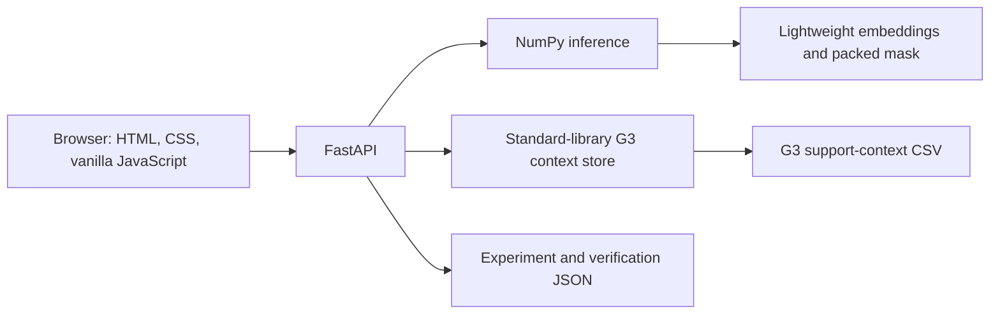

# CHEERS: PrimeKG Graph Composition + R-GCN for Drug–Drug Link Prediction

> **Research use only.** CHEERS is an academic graduation-project prototype, not a clinical decision-support system. Its predictions are unobserved links under the PrimeKG `drug_drug` target relation. Model scores are ranking values—not probabilities, calibrated confidence, clinical risk, interaction severity, or evidence that a drug pair is safe or dangerous.

**Repository:** `CHEERS-PrimeKG-RGCN-DDI-Prediction`  
**Web application:** CHEERS DDI Explorer  
**Final research title:** *Effect of Biomedical Knowledge Graph Composition on R-GCN-Based Drug–Drug Interaction Prediction*  
**Team:** Team CHEERS  
**Institution:** Pusan National University  
**Project type:** Computer Science graduation project

## Table of contents

- [Project overview](#project-overview)
- [Scientific scope](#scientific-scope)
- [Project evolution](#project-evolution)
- [Final research design](#final-research-design)
- [PrimeKG and DDI canonicalization](#primekg-and-ddi-canonicalization)
- [Fixed DDI split and leakage safeguards](#fixed-ddi-split-and-leakage-safeguards)
- [Graph variants](#graph-variants)
- [Global relation mapping](#global-relation-mapping)
- [Nodes and processed model data](#nodes-and-processed-model-data)
- [Model architecture](#model-architecture)
- [Negative sampling](#negative-sampling)
- [Training and model selection](#training-and-model-selection)
- [Filtered ranking evaluation](#filtered-ranking-evaluation)
- [Multi-seed results](#multi-seed-results)
- [Interpretation of graph composition](#interpretation-of-graph-composition)
- [Final model verification](#final-model-verification)
- [Lightweight NumPy runtime](#lightweight-numpy-runtime)
- [G3 graph-context runtime](#g3-graph-context-runtime)
- [Web application](#web-application)
- [API reference](#api-reference)
- [Local Windows setup](#local-windows-setup)
- [University training environment](#university-training-environment)
- [Original notebook pipeline](#original-notebook-pipeline)
- [Repository structure](#repository-structure)
- [Reproducibility levels](#reproducibility-levels)
- [Artifacts and audit trail](#artifacts-and-audit-trail)
- [What should be committed](#what-should-be-committed)
- [Limitations](#limitations)
- [Future work](#future-work)
- [Safety and responsible use](#safety-and-responsible-use)
- [Acknowledgment](#acknowledgment)

## Project overview

CHEERS studies the question:

> **How does biomedical knowledge graph composition affect R-GCN drug–drug link prediction?**

The final controlled experiment compares four PrimeKG graph variants while holding the DDI split, R-GCN architecture, decoder, training procedure, and evaluation protocol fixed. The graph variants range from DDI-only topology to a heterogeneous graph combining Drug–Drug, Drug–Gene/Protein, and Drug–Disease relationships.

The repository also contains a lightweight local demonstration application. The application serves the independently verified final G3/seed-44 export with NumPy, so a local user does not need the university GPU environment, PyTorch, or PyTorch Geometric.

Three scopes must be distinguished:

| Scope | Purpose | Status in this repository |
|---|---|---|
| Final graduation experiment | Controlled G0–G3 R-GCN graph-composition comparison | Results, selected checkpoint, selected G3 graph artifacts, summaries, and original inference code are included; full preprocessing/retraining workspace is not |
| Earlier project stages | Broader clinical-inference concept and KGE exploration | Documented historically; not presented as the final R-GCN experiment |
| Lightweight demonstration | Search, Top-K link ranking, experiment display, verification display, and pair-specific G3 context | Fully supported by the included NumPy/CSV runtime artifacts |

## Scientific scope

The final experiment uses **PrimeKG**. Its prediction target is:

- internal relation: `drug_drug`
- PrimeKG display relation: **synergistic interaction**

CHEERS therefore does **not** claim to predict every possible type of clinical drug–drug interaction. The application ranks candidate links that are unobserved in the known PrimeKG positive target set.

The model output is a raw bilinear ranking score. It must not be interpreted as:

- a probability;
- calibrated confidence;
- clinical risk or severity;
- evidence that two drugs are safe;
- evidence that two drugs are dangerous;
- a recommendation to prescribe, stop, combine, or change medication.

Likewise, the pair-context feature shows support relationships that were present in G3. It is descriptive graph context, not a causal explanation of a score and not clinical evidence.

## Project evolution

The initial graduation-project concept was a **Knowledge Graph-Based Clinical Inference System** with an intended workflow:

```text
symptoms → disease → treatment drug → drug–drug interaction warning
```

Initial data-source planning included PrimeKG, DrugBank, and DDInter. Early technical work included:

- TransE, ComplEx, and RotatE knowledge-graph embeddings;
- heterogeneous triple construction;
- entity normalization and relation standardization;
- merged biomedical triples;
- PyKEEN experimentation;
- MRR and Hits@K evaluation;
- FastAPI, React, and Cytoscape architecture planning.

As the project matured, the research question was narrowed to a more controlled and reproducible experiment: **PrimeKG graph composition + R-GCN + drug–drug link prediction**. This was a research refinement. The earlier KGE experiments are not the final R-GCN experiment, and the current application does not claim to implement the original end-to-end clinical pipeline.

## Final research design


The same target split, architecture, decoder, and model-selection rule were used for all graph variants. This isolates graph composition as the experimental variable.

## PrimeKG and DDI canonicalization

Training used the PrimeKG source file `kg.csv` in the university workspace. That raw file is **not included** in this portable repository and is ignored by `.gitignore`.

The original PrimeKG CSV schema was:

| Column | Meaning |
|---|---|
| `relation` | normalized relation name |
| `display_relation` | source-facing relation label |
| `x_index`, `y_index` | source node indices |
| `x_id`, `y_id` | source entity identifiers |
| `x_type`, `y_type` | entity types |
| `x_name`, `y_name` | entity names |
| `x_source`, `y_source` | metadata sources |

Observed DDI properties:

| Quantity | Value |
|---|---:|
| Directed `drug_drug` rows | 2,672,628 |
| Unique undirected Drug–Drug pairs | 1,336,314 |
| Reverse duplicates | 1,336,314 |
| Self-loops | 0 |

The source `drug_drug` relation was symmetric: every undirected pair appeared in both directions. Canonicalization ordered each pair and removed its reverse duplicate, producing 1,336,314 unique pairs. This prevented symmetric copies from leaking across train, validation, and test sets.

The canonical training-workspace artifact was:

```text
data/processed/primekg_ddi_unique.parquet
```

It is not included in this portable repository.

## Fixed DDI split and leakage safeguards

| Split | Unique canonical DDI pairs |
|---|---:|
| Training | 1,069,080 |
| Validation | 133,620 |
| Test | 133,614 |
| **Total** | **1,336,314** |

Safeguards:

- G0, G1, G2, and G3 used the same fixed DDI split.
- Train, validation, and test had no overlap.
- Validation and test DDI edges were excluded from message-passing adjacency.
- Symmetric DDI duplicates were removed before splitting.
- All held-out entities remained known, making the experiment transductive.

The original split files were `train.parquet`, `val.parquet`, and `test.parquet` under `data/processed/ddi_splits_final/` in the university training workspace. They are not included here.

## Graph variants

| Graph | Composition | Directed message-passing edges | Active relations |
|---|---|---:|---:|
| G0 | DDI only | 2,138,160 | 1 |
| G1 | DDI + Drug–Gene/Protein | 2,189,466 | 9 |
| G2 | DDI + Drug–Disease | 2,223,422 | 7 |
| G3 | DDI + Drug–Gene/Protein + Drug–Disease | 2,274,728 | 15 |

### G0 — DDI only

G0 contains only training Drug ↔ Drug target edges. The 1,069,080 undirected training pairs become 2,138,160 directed message-passing edges.

### G1 — DDI + Drug–Gene/Protein

G1 adds four forward support relations and their reverse message-passing relations:

| Forward relation | Edges |
|---|---:|
| target | 16,380 |
| enzyme | 5,317 |
| transporter | 3,092 |
| carrier | 864 |
| **Total** | **25,653** |

### G2 — DDI + Drug–Disease

G2 adds three forward support relations and their reverse message-passing relations:

| Forward relation | Edges |
|---|---:|
| indication | 9,388 |
| contraindication | 30,675 |
| off-label use | 2,568 |
| **Total** | **42,631** |

### G3 — combined context

G3 combines DDI, all four Drug–Gene/Protein relation types, and all three Drug–Disease relation types. It is the complete heterogeneous graph used by the selected final model.

## Global relation mapping

All variants used the same global relation allocation:

| ID | Relation | ID | Relation |
|---:|---|---:|---|
| 0 | `drug_drug` | 8 | `rev_carrier` |
| 1 | `target` | 9 | `indication` |
| 2 | `rev_target` | 10 | `rev_indication` |
| 3 | `enzyme` | 11 | `contraindication` |
| 4 | `rev_enzyme` | 12 | `rev_contraindication` |
| 5 | `transporter` | 13 | `off-label use` |
| 6 | `rev_transporter` | 14 | `rev_off-label use` |
| 7 | `carrier` |  |  |

Reverse support relations let information propagate in both directions while retaining directional relation semantics. The symmetric DDI relation used a single relation ID.

All graph variants allocated 15 relation slots, so parameter counts remained consistent. Inactive relation weights received no messages in variants where those relation types were absent.

## Nodes and processed model data

| Item | Value |
|---|---:|
| Shared graph nodes | 13,094 |
| Candidate drug nodes | 4,278 |
| Allocated relation types | 15 |
| Known-positive mask | 4,278 × 4,278 boolean matrix |
| Known-positive symmetric entries | 2,672,628 |

The university training workspace originally contained comprehensive mapping files and G0–G3 tensors. This portable repository includes only:

- `data/processed/mappings/drug_metadata.parquet`;
- `data/processed/rgcn_tensors/G3.pt`;
- `data/processed/rgcn_tensors/drug_node_ids.pt`;
- `data/processed/rgcn_tensors/ddi_known_positive_mask.pt`.

It does **not** include `node_mapping.parquet`, `relation_mapping.parquet`, `node_metadata_enriched.parquet`, G0–G2 tensors, or the DDI train/validation/test tensor files.

## Model architecture

The final model is a two-layer Relational Graph Convolutional Network implemented with PyTorch Geometric `RGCNConv`.

```text
node embedding
  → RGCNConv
  → ReLU
  → dropout
  → RGCNConv
  → symmetric DistMult-style DDI decoder
```

| Setting | Value |
|---|---:|
| Embedding dimension | 128 |
| Hidden dimension | 128 |
| Dropout | 0.2 |
| Learning rate | 0.001 |
| Weight decay | 1e-5 |
| Maximum epochs | 500 |
| Early-stopping patience | 10 |
| Positive training samples per epoch | 100,000 |
| Negative sampling ratio | 1:1 |
| Model parameters | 2,200,704 |

The decoder learns a `ddi_relation` vector and scores a pair with a symmetric DistMult-style bilinear operation. G0–G3 used the same architecture, decoder, allocated relation slots, and parameter count.

## Negative sampling

Training and evaluation negatives were sampled Drug–Drug pairs absent from the known positive DDI set. They are correctly described as **sampled unobserved pairs**, not confirmed negative interactions.

Knowledge graphs are incomplete. A pair absent from PrimeKG may be genuinely unsupported, missing from the source, or not represented under this particular target relation. Treating all unobserved pairs as clinically negative would therefore be incorrect.

## Training and model selection

The controlled procedure used:

1. one fixed DDI split for every graph variant;
2. deterministic sampling where applicable;
3. identical model architecture and optimization settings;
4. validation binary cross-entropy for checkpoint selection;
5. no test-set use during training or model selection;
6. a separate best-validation checkpoint for each graph/seed under the same rule.

The checkpoint packaged for the demonstration is:

| Field | Value |
|---|---|
| Graph | G3 |
| Seed | 44 |
| Best epoch | 499 |
| Included file | `checkpoints/rgcn_multiseed/G3_seed44_best.pt` |

## Filtered ranking evaluation

Evaluation used full filtered ranking over all 4,278 candidate drugs.

| Quantity | Value |
|---|---:|
| Held-out test DDI pairs | 133,614 |
| Directions evaluated per pair | 2 |
| Ranking queries | 267,228 |
| Candidates scored per query | 4,278 |

For each directional query:

1. score all 4,278 candidate drugs;
2. filter candidates already known as positive DDI links;
3. filter the self-pair;
4. restore the current held-out test target;
5. rank that target among the remaining candidates.

Metrics:

- **MRR:** rewards models that place the correct target closer to the top.
- **Hits@1:** fraction of queries whose correct target ranks first.
- **Hits@5:** fraction whose correct target appears in the top five.
- **Hits@10:** fraction whose correct target appears in the top ten.

## Multi-seed results

Robustness was evaluated with seeds **42, 43, and 44**. Values are mean ± sample standard deviation.

| Graph | MRR | Hits@1 | Hits@5 | Hits@10 |
|---|---:|---:|---:|---:|
| G0 | 0.529175 ± 0.008173 | 0.482165 ± 0.007551 | 0.575033 ± 0.009339 | 0.612105 ± 0.010650 |
| G1 | 0.533660 ± 0.007662 | 0.487017 ± 0.007901 | 0.577600 ± 0.008149 | 0.615398 ± 0.007840 |
| G2 | 0.529430 ± 0.008957 | 0.482665 ± 0.007721 | 0.574869 ± 0.010792 | 0.612203 ± 0.011603 |
| **G3** | **0.538767 ± 0.001432** | **0.490638 ± 0.000446** | **0.585269 ± 0.002606** | **0.623097 ± 0.002751** |

Main comparison:

- G3 ranked first by mean MRR.
- Absolute G3-versus-G0 MRR improvement: **+0.009592**.
- Relative MRR improvement: **+1.81%**.
- G3 exceeded G0 for MRR, Hits@1, Hits@5, and Hits@10 in all three evaluated seeds.

**The gain was modest but consistent across the three evaluated seeds.** Only three seeds were evaluated, so statistical significance is not claimed.

## Interpretation of graph composition

The observed comparison supports a restrained interpretation:

- Drug–Gene/Protein context produced a moderate average improvement over DDI-only.
- Drug–Disease context alone produced little mean improvement.
- Combining both relation families in G3 produced the strongest overall result.
- Heterogeneous biomedical context can complement direct DDI topology.
- The benefit depends on which relation families are included.

These are associations within this experimental design, not causal claims about biology or model reasoning.

## Final model verification

The included `final_release/FINAL_VERIFICATION_SUMMARY.json` records seven technical verification checks.

### 1. Target-edge leakage

- Every G0–G3 message-passing graph contained exactly 1,069,080 training DDI pairs.
- Validation DDI leakage: **0**.
- Test DDI leakage: **0**.

### 2. Held-out ranking sanity check

A sample of 1,000 test DDI pairs was evaluated in both directions:

| Quantity | Result |
|---|---:|
| Directed queries | 2,000 |
| MRR | 0.502226 |
| Hits@1 | 0.4525 |
| Hits@5 | 0.5465 |
| Hits@10 | 0.5870 |
| Median rank | 2 |

### 3. Positive-versus-unobserved score sanity

The check compared 5,000 held-out positive examples with 5,000 sampled unobserved examples.

| Quantity | Result |
|---|---:|
| Positive mean score | 161.370407 |
| Positive median score | 6.497307 |
| Unobserved mean score | -2.773926 |
| Unobserved median score | -1.558111 |
| Pairwise positive win rate | 97.54% |
| ROC-AUC | 0.9737 |

This sanity check evaluates score separation. It does **not** turn raw scores into probabilities or validate clinical interactions.

### 4. Real entity mapping

All 13,094 graph nodes and all 4,278 candidate drugs resolved to real metadata. Real-drug prediction outputs were inspected.

### 5. Checkpoint reproducibility

The G3 seed-44 checkpoint was loaded into a fresh model and the complete test evaluation was rerun:

| Metric | Reproduced value |
|---|---:|
| MRR | 0.540359 |
| Hits@1 | 0.490656 |
| Hits@5 | 0.588273 |
| Hits@10 | 0.626229 |

Differences from the stored seed-44 results were approximately (3 × 10^{-7}) or less. These are seed-44 checkpoint metrics; they are distinct from the three-seed mean table above.

### 6. Graph-composition integrity

Exact directed edge counts were independently confirmed:

| Graph | Edges |
|---|---:|
| G0 | 2,138,160 |
| G1 | 2,189,466 |
| G2 | 2,223,422 |
| G3 | 2,274,728 |

### 7. Clean standalone inference

A fresh process loaded the saved model, G3 graph, metadata, candidate drugs, and known-positive mask. The verified query was Colchicine (`DB01394`):

- candidate drugs: 4,278;
- known positive candidates filtered: 1,488;
- remaining unobserved candidates: 2,789.

| Rank | Candidate | DrugBank ID | Raw model score |
|---:|---|---|---:|
| 1 | Probenecid | DB01032 | 40.8524 |
| 2 | Hydrocortisone | DB00741 | 7.9139 |
| 3 | Ondansetron | DB00904 | 5.7451 |
| 4 | Sulfinpyrazone | DB01138 | 5.6925 |
| 5 | Melengestrol acetate | DB14659 | 5.5811 |
| 6 | Prednisone acetate | DB14646 | 5.2154 |
| 7 | Coumarin | DB04665 | 5.1917 |
| 8 | Dicoumarol | DB00266 | 5.1416 |
| 9 | Methylprednisolone hemisuccinate | DB14644 | 5.0514 |
| 10 | Oxycodone | DB00497 | 4.9924 |

These are model-ranked unobserved PrimeKG target links, not confirmed clinical DDIs.

## Lightweight NumPy runtime

The original training and checkpoint-verification path uses PyTorch and PyTorch Geometric. The local application instead uses verified exported embeddings and a pure NumPy scorer:

```python
query_embedding @ (candidate_embeddings * ddi_relation).T
```

Runtime artifacts:

```text
final_release/lightweight_runtime/
├── ddi_runtime_embeddings.npz
├── drug_metadata.csv
├── known_positive_mask_packed.npz
└── LIGHTWEIGHT_RUNTIME_MANIFEST.json
```

Prediction procedure:

1. resolve an exact drug name or DrugBank ID;
2. obtain the exported query embedding;
3. score all candidate embeddings;
4. unpack only the selected query drug's known-positive mask row;
5. filter known positive PrimeKG DDI links;
6. filter the self-pair;
7. rank the remaining unobserved candidates;
8. return Top-K raw ranking scores.

This deployment optimization neither retrains nor approximates the final model. It uses the post-encoding candidate embeddings and learned relation vector exported after verification. It reproduced the exact verified Colchicine Top-10, including the first score of 40.8524.

Verify it locally:

```powershell
python final_release\verify_lightweight_runtime.py
```

Expected:

```text
PASS: lightweight runtime reproduced the verified Colchicine Top-10.
First raw model score: 40.8524
```

## G3 graph-context runtime

The application can inspect the real forward Drug–Gene/Protein and Drug–Disease support relationships exported from the selected G3 graph.

```text
final_release/g3_context_runtime/
├── g3_drug_context.csv
├── g3_context_summary.json
└── G3_CONTEXT_MANIFEST.json
```

| Context export quantity | Value |
|---|---:|
| Total forward support rows | 68,284 |
| Drug–Gene/Protein edges | 25,653 |
| Drug–Disease edges | 42,631 |

Supported forward relations are `target`, `enzyme`, `transporter`, `carrier`, `indication`, `contraindication`, and `off-label use`.

`src/g3_context.py` uses only the Python standard library. It loads the CSV once, indexes primarily by DrugBank ID, preserves entity metadata, and retains all relations independently for each drug.

For example, these two facts:

```text
Drug A --contraindication--> Disease X
Drug B --indication-------> Disease X
```

remain two distinct relation lists. The runtime does not flatten them into a generic “shared disease” statement.

API example:

```http
GET /api/context/pair?drug_a_id=DB01394&drug_b_id=DB01032
```

Verified Colchicine + Probenecid context:

| Quantity | Value |
|---|---:|
| Colchicine support relationships | 39 |
| Probenecid support relationships | 69 |
| Shared unique entities | 33 |
| Shared Gene/Protein entities | 3 |
| Shared Disease entities | 30 |

The three shared Gene/Protein entities are:

| Entity | Colchicine relation | Probenecid relation |
|---|---|---|
| ALB | Carrier | Carrier |
| CYP2C8 | Enzyme | Enzyme |
| CYP3A4 | Enzyme | Enzyme |

These relationships must not be overinterpreted:

> These relationships are graph context available to the G3 model. They are not causal explanations of the model score.

> Shared context does not establish that a drug pair is clinically safe, dangerous, beneficial, or harmful.

Verify the context export:

```powershell
python final_release\verify_g3_context_runtime.py
```

## Web application

The current local architecture is:



Components:

| Layer | Technology | Role |
|---|---|---|
| Backend | FastAPI | API lifecycle, validation, JSON responses, and static-file serving |
| Inference | NumPy | Verified candidate scoring, filtering, and Top-K ranking |
| Context indexing | Python standard library | CSV loading, per-drug indexes, shared-entity calculation, relation preservation |
| Frontend | HTML, CSS, vanilla JavaScript | Search, results, charts, verification, and pair-context exploration |

The local demonstration requires no React, Node.js, npm, external CDN runtime, PyTorch, PyG, CUDA, or GPU.

Main functionality:

- drug search by partial name;
- exact-name and DrugBank-ID resolution;
- autocomplete;
- configurable Top-K prediction;
- raw model-score ranking;
- known-positive and self-pair filtering;
- graph-composition experiment information;
- verification information;
- pair-specific G3 context exploration;
- relation-preserving shared-context and individual-context tables.

## API reference

The implementation in `api/main.py` is the source of truth.

| Method | Path | Purpose | Inputs | Main output |
|---|---|---|---|---|
| GET | `/` | Serve the web application | none | `web/index.html` |
| GET | `/api` | API landing metadata | none | project identity, status, route index, disclaimer |
| GET | `/api/health` | Runtime readiness | none | model-loaded status, CPU device, graph, seed, epoch, candidate count |
| GET | `/api/model` | Model metadata | none | architecture, decoder, graph composition, dimensions, target relation |
| GET | `/api/experiment` | Final experiment summary | none | included result JSON plus restrained primary finding |
| GET | `/api/verification` | Seven-check verification record | none | included verification JSON |
| GET | `/api/drugs/search` | Autocomplete search | query `q`; optional `limit` 1–50 | matching drug name, DrugBank ID, and node ID |
| POST | `/api/predict` | Rank unobserved candidate links | JSON body with `drug` and `top_k` 1–50 | query metadata, model metadata, filtering counts, ranked predictions, disclaimer |
| GET | `/api/context/pair` | Retrieve real G3 support context for a pair | exact `drug_a_id` and `drug_b_id` | complete per-drug context, shared entities, separate relation lists, interpretation warning |
| GET | `/docs` | Interactive OpenAPI documentation | none | FastAPI Swagger UI |

Prediction request:

```json
{
  "drug": "DB01394",
  "top_k": 10
}
```

Pair-context response shape:

```json
{
  "drug_a": {
    "drug_id": "DB01394",
    "drug_name": "Colchicine",
    "total_context_edges": 39,
    "context": {
      "gene_protein": {"count": 0, "relationships": []},
      "disease": {"count": 0, "relationships": []}
    }
  },
  "drug_b": {},
  "shared": {
    "total": 33,
    "gene_protein_count": 3,
    "disease_count": 30,
    "entities": [
      {
        "context_name": "ALB",
        "context_group": "gene/protein",
        "drug_a_relations": ["carrier"],
        "drug_b_relations": ["carrier"]
      }
    ]
  },
  "interpretation": "..."
}
```

## Local Windows setup

Tested local runtime:

| Component | Version/status |
|---|---|
| Python | 3.12.6 |
| NumPy | 1.26.4 |
| FastAPI | 0.141.1 |
| Uvicorn | 0.52.1 |
| Pydantic | 2.13.4 |
| NVIDIA CUDA | not available on the tested local machine |

From PowerShell:

```powershell
python -m venv .venv
.\.venv\Scripts\Activate.ps1
python -m pip install -r final_release\lightweight_requirements.txt
```

Run both independent checks:

```powershell
python final_release\verify_lightweight_runtime.py
python final_release\verify_g3_context_runtime.py
```

Start the application:

```powershell
python -m uvicorn api.main:app --host 127.0.0.1 --port 8000
```

Open:

- application: <http://127.0.0.1:8000>
- API documentation: <http://127.0.0.1:8000/docs>

## University training environment

Full training and checkpoint evaluation were performed separately from the portable local runtime.

| Item | Training environment |
|---|---|
| Project directory | `/workspace/primekg_ddi_rgcn` |
| Conda environment | `primekg-rgcn` |
| Python | 3.10.20 |
| PyTorch | 2.2.1+cu121 |
| PyTorch Geometric | 2.5.3 |
| NumPy | 1.26.4 |
| CUDA available | true |
| Server GPUs | NVIDIA GeForce RTX 2080 Ti ×4 |
| Final training device | physical GPU2 isolated with `CUDA_VISIBLE_DEVICES` |

Relevant PyG stack:

| Package | Version |
|---|---|
| `pyg_lib` | 0.4.0+pt22cu121 |
| `torch_scatter` | 2.1.2+pt22cu121 |
| `torch_sparse` | 0.6.18+pt22cu121 |
| `torch_cluster` | 1.6.3+pt22cu121 |
| `torch_spline_conv` | 1.2.5+pt22cu121 |

Full retraining requires the original PrimeKG source data, preprocessing outputs, notebooks/configuration, and PyTorch/PyG environment. It is different from running the lightweight application.

## Original notebook pipeline

The notebooks belong to the university training workspace and are **not included** in this portable repository.

| Notebook | Purpose |
|---|---|
| `00_environment_check.ipynb` | environment, GPU, and package validation |
| `01_inspect_primekg.ipynb` | PrimeKG inspection, relation counts, and DDI symmetry analysis |
| `02_build_graph_variants.ipynb` | G0–G3 construction, reverse support relations, and leakage/count validation |
| `03_prepare_rgcn_data.ipynb` | global mappings, tensor conversion, target splits, candidate-drug tensor, and known-positive mask |
| `04_train_rgcn.ipynb` | R-GCN architecture, training, checkpoint selection, and full filtered ranking |
| `05_repeat_seeds.ipynb` | seeds 42–44, robustness evaluation, and mean ± SD generation |
| `06_finalize_project.ipynb` | verification summaries, experiment freeze, portable application packaging, NumPy export, and G3 context export |

The absence of these notebooks and the raw/preprocessing artifacts means this repository should not claim complete from-scratch retraining.

## Repository structure

This tree reflects the actual portable folder after repository documentation was added. Generated `.venv/` and `__pycache__/` directories are omitted because they are ignored.

```text
.
├── api/
│   ├── __init__.py
│   └── main.py
├── checkpoints/
│   └── rgcn_multiseed/
│       └── G3_seed44_best.pt
├── data/
│   └── processed/
│       ├── mappings/
│       │   └── drug_metadata.parquet
│       └── rgcn_tensors/
│           ├── G3.pt
│           ├── ddi_known_positive_mask.pt
│           └── drug_node_ids.pt
├── final_release/
│   ├── g3_context_runtime/
│   │   ├── G3_CONTEXT_MANIFEST.json
│   │   ├── g3_context_summary.json
│   │   └── g3_drug_context.csv
│   ├── lightweight_runtime/
│   │   ├── LIGHTWEIGHT_RUNTIME_MANIFEST.json
│   │   ├── ddi_runtime_embeddings.npz
│   │   ├── drug_metadata.csv
│   │   └── known_positive_mask_packed.npz
│   ├── app_requirements.txt
│   ├── FINAL_VERIFICATION_SUMMARY.json
│   ├── lightweight_requirements.txt
│   ├── verify_g3_context_runtime.py
│   └── verify_lightweight_runtime.py
├── results/
│   └── rgcn_multiseed/
│       └── final_experiment_summary.json
├── src/
│   ├── __init__.py
│   ├── g3_context.py
│   ├── inference.py
│   ├── lightweight_inference.py
│   └── rgcn_model.py
├── web/
│   ├── app.js
│   ├── index.html
│   └── styles.css
├── .gitignore
├── PORTABLE_APP_MANIFEST.json
└── README.md
```

### Runtime-required files

For the complete lightweight web demonstration:

- `api/main.py`;
- `src/lightweight_inference.py`;
- `src/g3_context.py`;
- `web/index.html`, `web/styles.css`, and `web/app.js`;
- all files under `final_release/lightweight_runtime/`;
- all files under `final_release/g3_context_runtime/`;
- `results/rgcn_multiseed/final_experiment_summary.json`;
- `final_release/FINAL_VERIFICATION_SUMMARY.json`;
- `final_release/lightweight_requirements.txt`.

The two verification scripts are not required for serving requests, but they should be retained to validate the export.

### Included research/archive files

The following are preserved original PyTorch/research artifacts and are not loaded by the NumPy application:

- `checkpoints/rgcn_multiseed/G3_seed44_best.pt`;
- `data/processed/rgcn_tensors/G3.pt`;
- `data/processed/rgcn_tensors/ddi_known_positive_mask.pt`;
- `data/processed/rgcn_tensors/drug_node_ids.pt`;
- `data/processed/mappings/drug_metadata.parquet`;
- `src/inference.py`;
- `src/rgcn_model.py`.

`final_release/app_requirements.txt` is the earlier application requirement list. Use `final_release/lightweight_requirements.txt` for the current NumPy application.

## Reproducibility levels

### Level 1 — run the verified demonstration

Supported completely by this portable repository.

Requires:

- Python;
- NumPy;
- FastAPI;
- Uvicorn;
- Pydantic.

Does not require:

- a GPU;
- CUDA;
- PyTorch or PyTorch Geometric;
- raw PrimeKG `kg.csv`;
- the university Conda environment.

### Level 2 — full experiment retraining

Not fully self-contained in this portable repository.

Requires:

- the PrimeKG source data;
- canonical DDI and fixed split artifacts;
- complete node/relation mappings;
- G0–G3 preprocessing outputs;
- PyTorch/PyG;
- original training notebooks/configuration;
- a GPU is recommended.

Those materials were retained in the university experiment workspace. The included selected checkpoint and G3 artifacts support archival inspection and the original inference path, but they do not constitute a full G0–G3 from-scratch pipeline.

## Artifacts and audit trail

### Included final-release artifacts

| Path | Role |
|---|---|
| `final_release/lightweight_runtime/ddi_runtime_embeddings.npz` | candidate embeddings and learned DDI relation vector |
| `final_release/lightweight_runtime/known_positive_mask_packed.npz` | packed known-positive candidate mask |
| `final_release/lightweight_runtime/drug_metadata.csv` | portable drug identity mapping |
| `final_release/lightweight_runtime/LIGHTWEIGHT_RUNTIME_MANIFEST.json` | runtime facts and verified Top-10 ordering |
| `final_release/g3_context_runtime/g3_drug_context.csv` | 68,284 real forward G3 support edges |
| `final_release/g3_context_runtime/g3_context_summary.json` | context counts and interpretation warning |
| `final_release/g3_context_runtime/G3_CONTEXT_MANIFEST.json` | SHA256 checks for the context CSV and summary |
| `final_release/verify_lightweight_runtime.py` | independent Top-10 export check |
| `final_release/verify_g3_context_runtime.py` | independent edge-count and shared-context check |
| `final_release/FINAL_VERIFICATION_SUMMARY.json` | seven-check final model record |
| `results/rgcn_multiseed/final_experiment_summary.json` | final graph-composition results |

The G3 context manifest currently matches its files.

### Experiment-freeze history

In the university training workspace, 44 critical experiment files were frozen with SHA256 hashes. During finalization, `05_repeat_seeds.ipynb` was accidentally changed at the notebook serialization level after the initial freeze. The other 43 of 44 artifacts remained byte-identical, no accidental marker/code remained, and an amendment was created instead of silently replacing the original manifest.

Preserving the original manifest and adding an amendment is better audit practice because it retains the chronology and makes the post-freeze change explicit.

The following training-workspace audit files are **not present** in this portable repository:

- `FINAL_EXPERIMENT_MANIFEST_SHA256.json`;
- `FINAL_EXPERIMENT_FREEZE.txt`;
- `FINAL_EXPERIMENT_MANIFEST_AMENDMENT_01.json`;
- `FINAL_EXPERIMENT_FREEZE_AMENDMENT_01.txt`.

### Legacy portable manifest warning

`PORTABLE_APP_MANIFEST.json` predates the current NumPy/context/frontend updates. Eleven entries still match, but its hashes/sizes are stale for:

- `api/main.py`;
- `src/__init__.py`;
- `web/app.js`;
- `web/index.html`;
- `web/styles.css`.

It should not be presented as a current integrity manifest. Before the first public commit, either generate a clearly versioned replacement/amendment or retain this file explicitly as a historical snapshot.

## What should be committed

### Commit

- `README.md` and `.gitignore`;
- `api/`, `src/`, and `web/`;
- required lightweight runtime and G3 context runtime exports;
- both independent verification scripts;
- final experiment and verification summaries;
- current requirements;
- valid manifests and any clearly labeled historical manifests.

The 6.028 MB G3 context CSV and verified lightweight NPZ/CSV files are runtime dependencies and are intentionally not ignored.

### Do not commit

- `.venv/`;
- `__pycache__/` and `*.pyc`;
- notebook checkpoints;
- local editor settings;
- logs and PID files;
- `.env` files, keys, or credentials;
- raw PrimeKG `kg.csv`;
- future raw/downloaded datasets under `data/raw/` or `data/downloads/`.

### Decide before the first public commit

Two included archive artifacts exceed 25 MB:

| File | Bytes | Approximate size | GitHub 100 MB limit |
|---|---:|---:|---|
| `data/processed/rgcn_tensors/G3.pt` | 54,594,810 | 52.066 MB | below limit |
| `checkpoints/rgcn_multiseed/G3_seed44_best.pt` | 26,446,322 | 25.221 MB | below limit |

No file exceeds GitHub's normal 100 MB per-file limit. Nevertheless, committing binary model/tensor artifacts directly makes repository history permanently large. If they are retained for academic reproducibility, Git LFS or a versioned release/archive is preferable. If the repository is intended only for Level-1 demonstration, they can be distributed separately with checksums—but they must not be deleted merely to reduce repository size.

Also decide:

- how to license the code;
- whether PrimeKG-derived metadata/context may be redistributed under the applicable data terms;
- whether to replace/amend the stale legacy portable manifest.

## Limitations

- The final experiment uses PrimeKG only.
- The target is PrimeKG's synergistic-interaction `drug_drug` relation, not every clinical DDI type.
- One principal GNN architecture was evaluated.
- Robustness evaluation used only three seeds.
- Statistical significance is not claimed.
- Evaluation is transductive; held-out entities remain known.
- Sampled unobserved negatives are not confirmed non-interactions.
- The study performs coarse relation-family ablation, not per-relation ablation.
- Knowledge-graph incompleteness and source bias can affect training and evaluation.
- Raw model scores are not calibrated probabilities.
- Graph context is not a causal explanation of a prediction.
- An unobserved predicted link is not a confirmed interaction.
- Full preprocessing and retraining assets are not included in this portable folder.
- The application is a research demonstration, not clinical decision support.
- No medication or prescribing guidance should be derived from its output.

## Future work

- per-relation ablation;
- more seeds and bootstrap uncertainty estimates;
- stronger GNN and knowledge-graph baselines;
- inductive and cold-start evaluation;
- external DDI validation;
- calibrated classification where scientifically appropriate;
- additional biomedical data sources;
- source-backed drug-safety evidence;
- DailyMed or openFDA evidence retrieval;
- PubMed literature retrieval;
- evidence-grounded AI summaries;
- pair-level explanatory paths;
- stronger UI communication of relation semantics.

DailyMed/openFDA, PubMed, external safety evidence, and LLM-generated summaries are future work and are not implemented in the current application.

## Safety and responsible use

**Research use only.**

Predicted candidates represent unobserved links according to the model and PrimeKG target relation. Model scores are ranking values, not probabilities. Results must not be used for:

- prescribing medication;
- stopping medication;
- changing doses;
- determining whether a drug combination is safe;
- determining whether a drug combination is dangerous;
- making clinical decisions.

Graph context is descriptive knowledge-graph context, not causal medical evidence. Any clinical interpretation requires qualified professionals and appropriate external evidence.

## Acknowledgment

This repository documents a Computer Science graduation project by **Team CHEERS** at **Pusan National University**. The final experiment is based on PrimeKG-derived graph data. No individual team-member names are listed because none are present in the portable project metadata.
